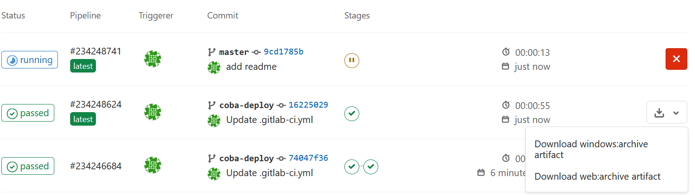
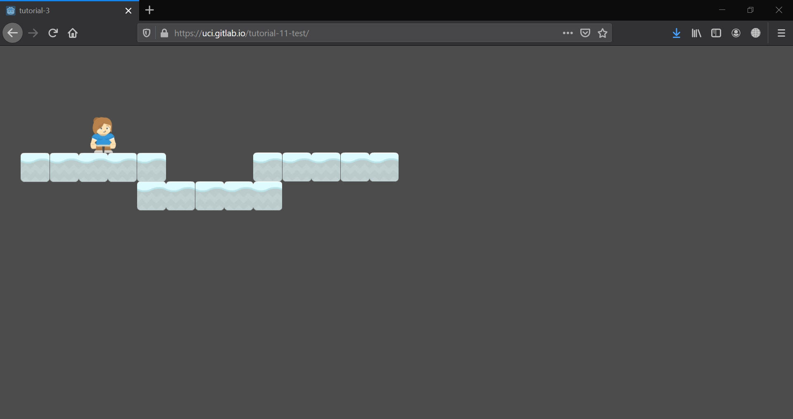

# Tutorial 11 - Continuous Integration & Deployment

> Peringatan: tutorial 11 bersifat **opsional**.

Halooo, selamat datang di tutorial 11 kuliah Game Development. Pada tutorial kali ini, kamu akan mempelajari cara untuk membuat _CI_ dan _CD_ untuk melakukan otomasi integrasi dan _deployment_ dari proyek Godot kalian. ita sebagai tim pengembang tidak lagi perlu untuk secara manual mengexport proyek Godot yang sedang dikerjakan menjadi sebuah _executable file_. Kita juga bisa mengefisiensikan waktu untuk pengunggah _executeable file_ tersebut ke sebuah _marketplace_ seperti itch.io.

## Pengantar

Sebagaimana yang kita ketahui, sebagai sebuah tim pengembang kita akan sangat terbantu dengan keberadaan _CI_ dan _CD_ ini. Metode ini memungkinkan proyek yang kita kerjakan bisa dengan otomatis terintegrasi dengan proyek yang saat ini sudah ada. Terlebih lagi metode ini dapat melakukan _deployment_ secara otomatis saat kita melakukan _merge_ ke suatu _branch production_, yang biasanya akan terjadi sebuah _deployment_ ke sebuah _environment_ baru. Untuk mengetahui lebih lanjut mengenai apa itu _CI_ dan _CD_ kalian bisa mengakses [link ini](https://en.wikipedia.org/wiki/CI/CD).

Sebenarnya banyak cara untuk membuat _CI_ dan _CD_ pada proyek Godot kalian. Pada tutorial kali ini kita akan membuat GitLab CI yang akan menggunakan sebuah Docker Image dimana dokumentasi lengkapnya dapat diakses pada link [GitLab ini](https://gitlab.com/BARICHELLO/godot-ci). Lalu untuk cara _export_ proyek Godot kalian menggunakan _Command Line_ bisa diakses pada dokumentasi [Godot ini](https://docs.godotengine.org/en/stable/getting_started/workflow/export/exporting_projects.html#exporting-from-the-command-line).
## Auto build to Gitlab artifact

Pertama adalah bagaimana kita membuild atau mengexport otomatis proyek ke bentuk _executable_ untuk berbagai jenis sistem operasi seperti Windows, MacOS, Ubuntu, atau bahkan berbasis web (HTML5). Berikut adalah langkah-langkah yang bisa kalian ikuti (langkah ini mengacu pada referensi yang telah diberikan sebelumnya).

1. Copy dan Paste tutorial (pada contoh ini adalah tutorial-X) yang ingin kalian dibuatkan CI-nya dengan struktur sebagai berikut:

```
tutorial-11
---- tutorial-X
-------- Assets
-------- Scenes
-------- project.godot
-------- etc.
```

2. Buat file `.gitlab-ci.yml` baru di dalam folder **tutorial-11** dimana setara dengan folder **tutorial-X**, lalu isi dengan _script_ berikut:

```
image: barichello/godot-ci:3.2.3

stages:
  - export
  - deploy

variables:
  EXPORT_NAME: tutorial-X

windows:
  stage: export
  script:
    - mkdir -v -p build/windows
    - cd $EXPORT_NAME
    - godot -v --export "Windows Desktop" ../build/windows/$EXPORT_NAME.exe
  artifacts:
    name: $EXPORT_NAME-$CI_JOB_NAME
    paths:
      - build/windows

web:
  stage: export
  script:
    - mkdir -v -p build/web
    - cd $EXPORT_NAME
    - godot -v --export "HTML5" ../build/web/index.html
  artifacts:
    name: $EXPORT_NAME-$CI_JOB_NAME
    paths:
      - build/web
```

Secara singkat, _script_ ini akan menjalakan sebuah _stage_ `export` di mana ada dua tahap yaitu `windows` dan `web`. Ditiap tahap ini akan membuat sebuah direktori atau folder _artifact_ baru, dimana tiap folder ini akan berisi _archive_ dari _export_ proyek Godot kalian.

3. Sesuaikan variabel `EXPORT_NAME: tutorial-X` dengan nama folder project yang tadi kalian copy dan paste ke **tutorial-11**.

4. Buka aplikasi Godot, lalu _import project_ pada **tutorial-X** ini. Lalu _setting project export_ di **Project>export..>Add..** (tambahkan windows dan html sesuai dengan stage: export pada gitlab ci yml tadi).


5. Jika ada _warning_ seperti ini


Lakukan instalasi _template_ terlebih dahulu dengan menekan **Manage Export Template > Download (download missing template) > Klik template yang tersedia** lalu tunggu sampai instalasi selesai. 

6. Setelah selesai dan sudah ada dua template windows dan html, tekan _close_ pada pop up **export..** lalu save project dengan ctrl+s. Seharusnya akan muncul sebuah file `export_presets.cfg` didalam folder **tutorial-X**.

7. Lakukan _push_ ke Gitlab kalian dan perhatikan _pipeline_ dari _commit_ kalian saat itu. 

8. Jika sudah slesai pipelinenya, cara mendownload _artifact_ yang sudah dibuild bisa diakses pada **CI/CD gitlab > pipelines > lalu cek button download pada commit yang tadi dilakukan** seharusnya ada dua pilihan _artifact_ untuk didownload.



9. Download salah satu _artifact_ lalu _extract_ dan jalankan _executable_ filenya, walaaaa selesai kalian berhasil mengautomisasi _build_ proyek Godot kalian.

## Auto deploy to Gitlab.io

Selanjutnya adalah bagaimana _artifact_ tersebut bisa diakses oleh pengguna pada _marketplace_ atau bisa langsung dimainkan dengan _executable_ web (HTML5)? Berikut adalah tutorial untuk menjalankan _executable_ web (HTML5) tadi dengan menggunakan gilab.io. 

1. Buat sebuah branch baru yang akan menjadi tempat _artifact_ HTML5. Pada contoh ini nama branch adalah `git-deploy`.

2. Buat sebuah folder **public** didalam branch `git-deploy`. Ingat Gitlab tidak bisa mengidentifikasi folder kosong, jadi tambahkan saja sebuah `README.md` bebas didalam folder **public** ini. 

3. Setelah branch baru selesai dibuat, tambahkan potongan _script_ berikut ini di lokasi terbawah file `.gitlab-ci.yml`: 

```
pages:
  stage: deploy
  dependencies:
    - web
  script:
    - git fetch
    - git checkout git-deploy
    - rm -f *.md
    - mv build/web/** ./public
  artifacts:
    paths:
      - public
``` 

Secara singkat script ini mengubah branch ke `git-deploy` dan menghapus semua `.md` lalu akan memindahkan _artifact_ dari _stage export_ web (HTML5) kedalam folder **public**. 

4. Selanjutnya seperti biasa yaitu _push_ hasil pekerjaan kedalam Gitlab. Lalu perhatikan _pipeline_ dari _commit_ ini. 

5. Setelah pipeline berhasil, ketik **https://[user_gitlab_kalian].gitlab.io/tutorial-11/** pada browser kalian. Berikut adalah hasilnya (menggunakan tutorial-3). 



## Tugas

- [ ] Buat _build_ otomatis kedalam sistem operasi Linux dan MacOS
- [ ] Pastikan _archive_ dari _artifact_ dapat didownload dan berisi file yang diinginkan
- [ ] Buat _deployment_ otomatis kedalam Github (jika ingin lebih menantang boleh melakukan _deployment_ langsung ke itch.io)
- [ ] Pastikan game dapat dimainkan pada browser dengan mengakses url tertentu
- [ ] Laporkan bagaimana cara mu mengerjakan tugas ini dan lampirkan pula _link_ Github dan URL game _browser_ kalian. Berkas laporan yang dituliskan dalam format Markdown (misal: `T11_[NPM].md`).

## Pengumpulan

Kumpulkan dengan memasukkan berkasnya ke dalam Git dan _push_ ke _fork_ materi
tutorial ini di repositori milik pribadi. **Jangan _push_ atau membuat Merge
Request ke repositori _upstream_ materi tutorial kecuali jika kamu ingin
kontribusi materi atau memperbaiki materi yang sudah dipublikasikan!**

Tenggat waktu pengumpulan adalah **Sabtu, 2 Januari 2021, pukul 21:00**.

## Referensi

- [Gitlab godot-ci](https://gitlab.com/BARICHELLO/godot-ci)
- [Dokumentasi Godot](https://docs.godotengine.org/en/stable/getting_started/workflow/export/exporting_projects.html#exporting-from-the-command-line)
- Materi tutorial pengenalan Godot Engine, kuliah Game Development semester
  gasal 2020/2021 Fakultas Ilmu Komputer Universitas Indonesia.
