# Tutorial 4 - Basic 2D Level Design

Selamat datang pada tutorial keempat kuliah Game Development. Pada tutorial
kali ini, kamu akan mempelajari cara membuat level sederhana menggunakan Godot Engine.
Di akhir tutorial ini, diharapkan kamu paham dengan penggunaan _TileMap_ dan _Signals_

## Daftar Isi

- [Tutorial 4 - Basic 2D Level Design](#Tutorial-4---Basic-2D-Level-Design)
  - [Daftar Isi](#daftar-isi)
  - [Pengantar](#pengantar)
    - [What Is a Level?](#What-Is-a-Level)
    - [Level Example](#Level-Example)
  - [Creating A Simple Level using TileMap](#Creating-A-Simple-Level-using-Tilemap)
    - [Preparation](#Preparation)
    - [Making Tile Set](#Making-Tile-Set)
    - [Paint the TileMap](#Paint-the-TileMap)
  - [Making the Camera Follows The Player](#Making-the-Camera-Follows-The-Player)
    - [How Simple It Is](#How-Simple-It-Is)
  - [Adding Area Trigger for Lose and Win Condition](#Adding-Area-Trigger-for-Lose-and-Win-Condition)
    - [Set Up](#set-up)
    - [What is Signals?](#What-is-Signals)
    - [Using Signals](#Using-Signals)
    - [Adding It to the Level](#Adding-It-to-the-Level)
  - [Bonus To Do](#bonus-to-do)
  - [Instruksi Pengerjaan](#Instruksi-Pengerjaan)
  - [Skema Penilaian](#skema-penilaian)
  - [Pengumpulan](#pengumpulan)
  - [Referensi](#referensi)

## Pengantar

### What Is a Level?

Pada tutorial sebelumnya kita sudah membuat sebuah _player_ sederhana yang dapat bergerak ke kanan dan kiri dan juga dapat melompat. 
Namun tempat ia bergerak masih sangat terbatas, kita memerlukan sebuah _level_ supaya _player_ tidak hanya jatuh ke jurang tanpa dasar.

Sebuah _level_ pada dasarnya adalah tempat dimana _player_ dapat melakukan _action_ dan mungkin memiliki sebuah _goal_.

### Level Example

Contoh sebuah level yang terlihat sederhana:

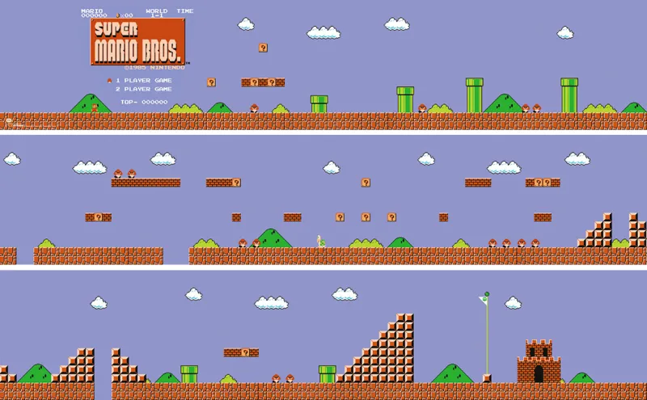

> Super Mario Bros World 1-1, Nintendo 1985

Kita akan membuat sebuah level 2D sederhana menggunakan salah satu fitur Godot Engine yaitu _TileMap_.
Pada tutorial ini akan didemonstrasikan:
- Membuat TileSet untuk TileMap
- Membuat level menggunakan TileMap
- Membuat kamera mengikuti player
- Membuat trigger untuk lose dan win condition

## Creating A Simple Level using TileMap

### Preparation

Buka template project di Godot Editor, kemudian buka scene ```Scenes/Level 1.tscn```.
Dalam scene tersebut akan terdapat suatu mahluk yang hanya akan jatuh jika scene dimainkan.

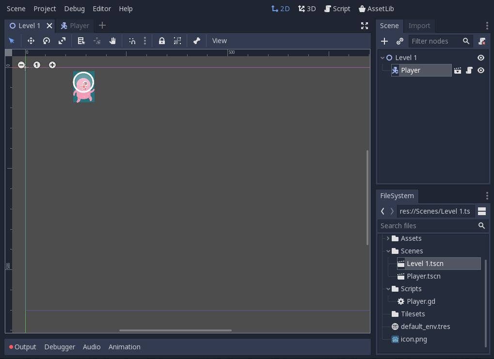

Klik kanan pada node ```Level 1``` dan pilih ```Add Child Node```, kemudian pilih ```TileMap```.

Setelah TileMap berhasil ditambahkan akan terlihat _grid_ berwarna oranye pada scene dan muncul 1 tab baru disebelah scene.
(Jika tidak terjadi apa-apa, coba select node TileMap)

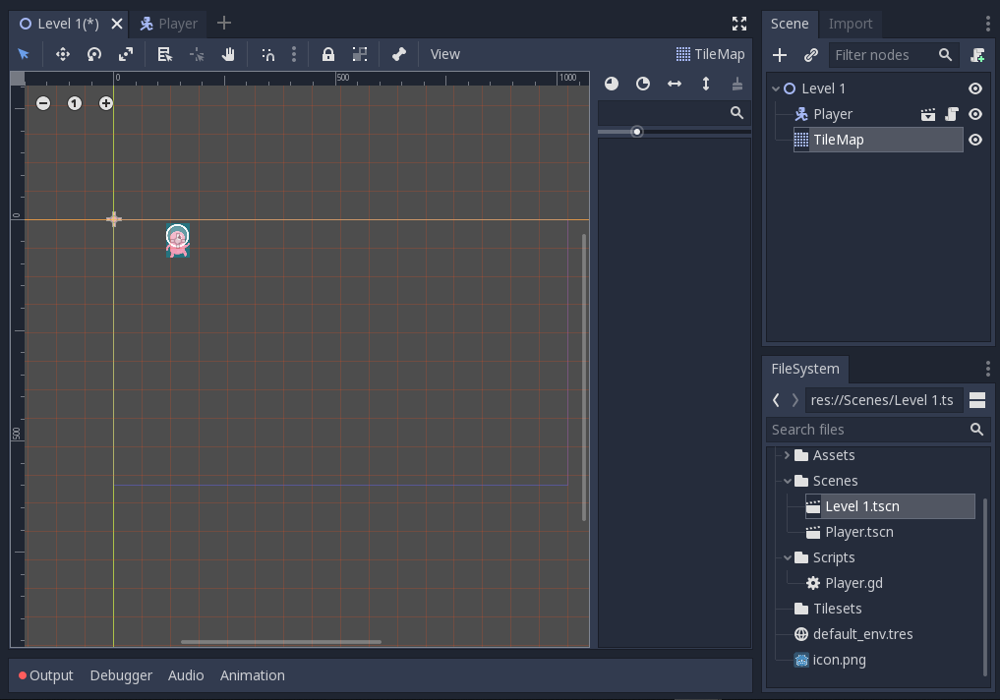

Pada tab Inspector, atur ```Size``` menjadi 128 untuk X dan Y.

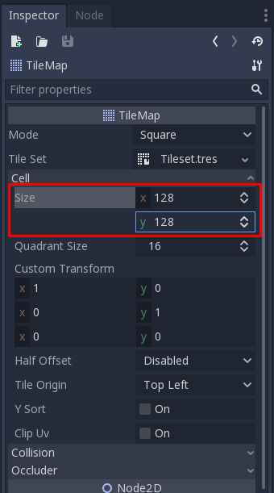

### Making Tile Set

Jika diibaratkan dengan melukis, kita baru saja mempersiapkan kanvas dan kuas. Kita masih kekurangan cat untuk melukis.
Untuk mempersiapkan cat, pada tab Inspector klik dropdown menu ```Tile Set``` dan pilih ```New TileSet```.

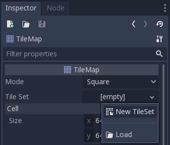

Lalu klik lagi dropdown tadi dan pilih ```Edit```.

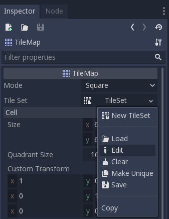

Akan muncul window baru dengan nama ```TileSet```.

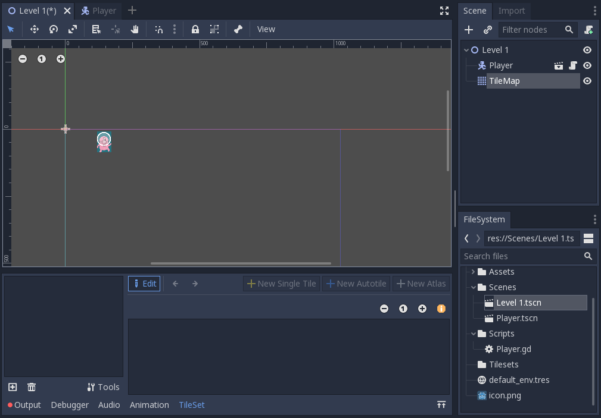

Lalu klik ikon plus di kiri bawah window tersebut dan pilih ```Assets/kenney_platformerpack/Spritesheets/*```.
Dalam contoh ini digunakan ```spritesheet_gr_dirt.png```, namun kamu bebas menggunakan yang tersedia atau menambah sendiri.
Jika sudah maka akan tampil seperti berikut.

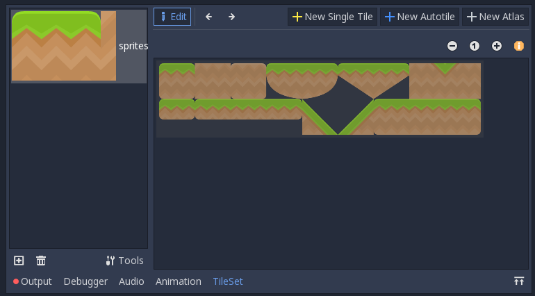

Terdapat beberapa cara untuk membuat Tile Set:
- _Single Tile_ untuk _tile_ satuan jika ingin memasukan setiap _tile_ satu-persatu.
- _Autotile_ untuk _tile_ yang bisa di automasikan pemilihannya berdasarkan _tile_ sekelilingnya, contohnya pada game dengan tipe _top-down perspective_.
- _Atlas_ untuk _tile_ yang bertipe sejenis dan akan lebih mudah diorganisir daripada menggunakan _single tile_ berulang kali.

Pada tutorial ini kita akan menggunakan _Atlas_.
Klik ```New Atlas```, lalu drag area yang akan dijadikan Tile Set. 
> Tips: supaya hidup kamu mudah silakan menggunakan fitur ```snap to grid``` (Klik logo magnet).

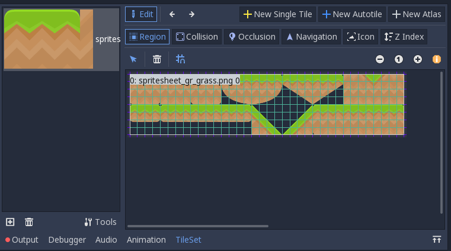

Kemudian pada tab Inspector silakan isi nama sesuka hati dan atur ```Subtile Size``` ke 128 untuk X dan Y.
Jika sudah jangan lupa untuk men-_save_ Tile Set (penamaan bebas).

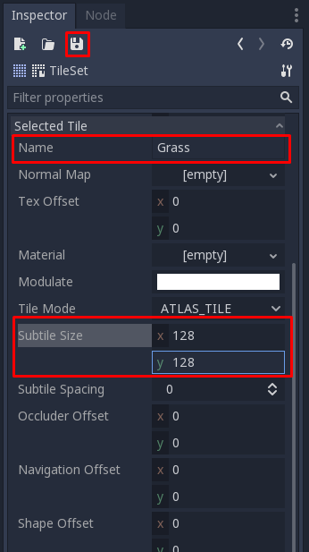

Supaya player dapat _collide_ dengan tile, kita perlu menambahkan _collider_ pada tile tersebut.
Untuk melakukannya klik ```Collision```, klik ke _subtile_ yang dituju, klik ikon kotak (no 3)), dan akhirnya klik lagi _subtile_ tersebut.

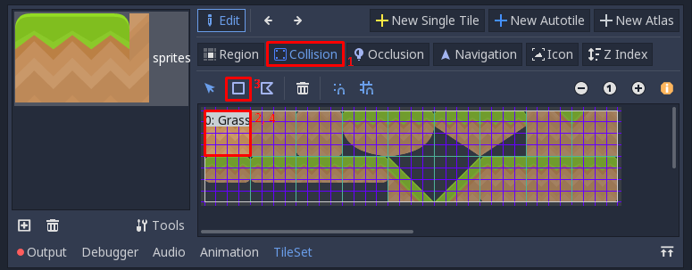

Untuk mengatur bentuk _collider_ silakan geser _vertex_ (lingkaran merah) sesuai keinginan.
Ulangi langkah 2 sampai 4 untuk setiap _subtile_. Berikut contoh jadinya.

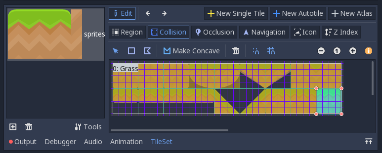

### Paint the TileMap

Jika sudah berhasil, klik node TileMap pada tab Scene dan Tile Set tadi akan tampil dan siap untuk digunakan. Selamat berkreasi.

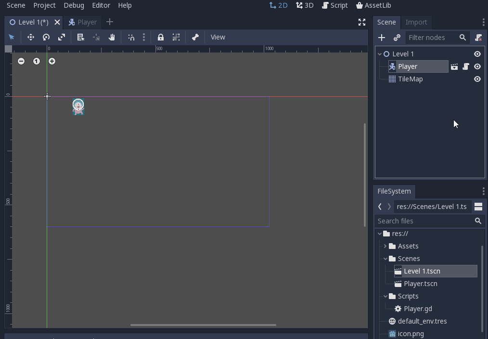

> Note : Node TileMap di scale menjadi 0.5 pada X dan Y agar ukuran tile tidak terlalu besar dibanding player.
> (Tab Inspector > Transform > Scale)

## Making the Camera Follows The Player

Sekarang kita sudah memiliki sebuah level, namun jika scene di-_play_ kamera akan diam di tempat awal dan membatasi apa yang bisa dilihat.
Oleh karena itu kita akan membuat kamera yang akan mengikuti kemanapun mahluk pink itu pergi.

### How Simple It Is

Buka scene ```Scenes/Player.tscn```, tambah node ```Camera2D``` sebagai child dari ```Player```.
Kemudian pada tab Inspector centang ```Current```.
That's it, you're done.

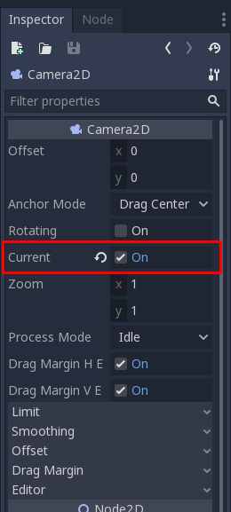

Sekarang kamera akan selalu mengikuti mahluk itu kemanapun ia pergi.

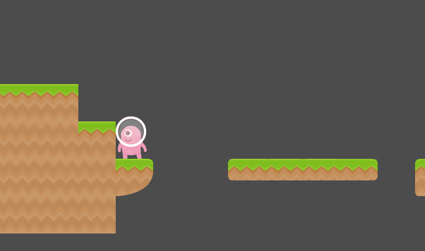

## Adding Area Trigger for Lose and Win Condition

Sebuah level tidak lengkap tanpa tujuan akhir, atau jika si mahluk terpleset dan jatuh ke jurang, dia hanya bisa berkontemplasi sampai akhir jaman.
Supaya mahluk tersebut tidak bernasib sama seperti Kars, mari kita buat zona untuk _lose_ dan _win_ condition.

### Set Up

Pertama buat scene baru (nama bebas) dengan ```Area2D``` sebagai root node.

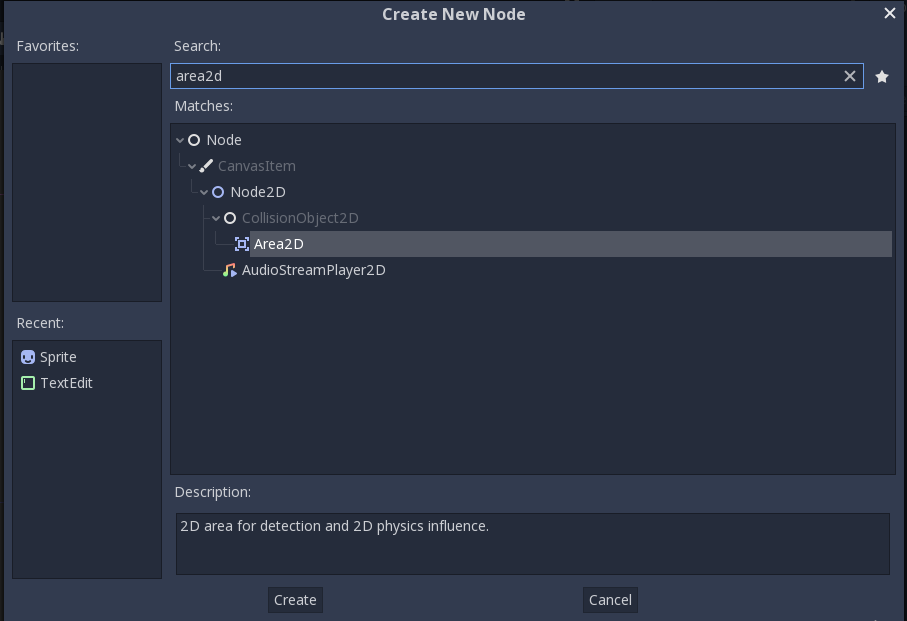

Lalu tambahkan node ```CollisionShape2D``` sebagai child dari node ```Area2D``` tadi.
Jangan lupa untuk membuat _collision shape_ pada node ```CollisionShape2D``` (Kamu seharusnya sudah pernah melakukannya pada tutorial sebelumnya).

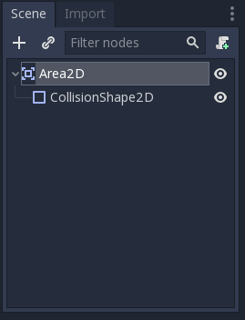

Kemudian _attach_ sebuah script pada node ```Area2D``` (penamaan bebas).
Hapus semua baris kecuali baris pertama, kita akan menggunakan _Signals_ untuk fitur ini.

### What is Signals?

Sesuai dengan namanya, _Signals_ berfungsi untuk memberikan "tanda" jika suatu kondisi khusus terpenuhi.
Yang dimaksud dengan memberikan tanda disini adalah mengeksekusi suatu fungsi yang kita definisikan sendiri.
Jenis _Signals_ yang ada pada suatu node akan berbeda-beda tergantung tipe node tersebut.

### Using Signals

Pertama select node ```Area2D``` lalu buka tab ```Node```.
Lalu pada subtab ```Signals``` pilih ```body_entered(PhysicsBody2D body)``` dan klik tombol ```Connect``` di kanan bawah tab tersebut.

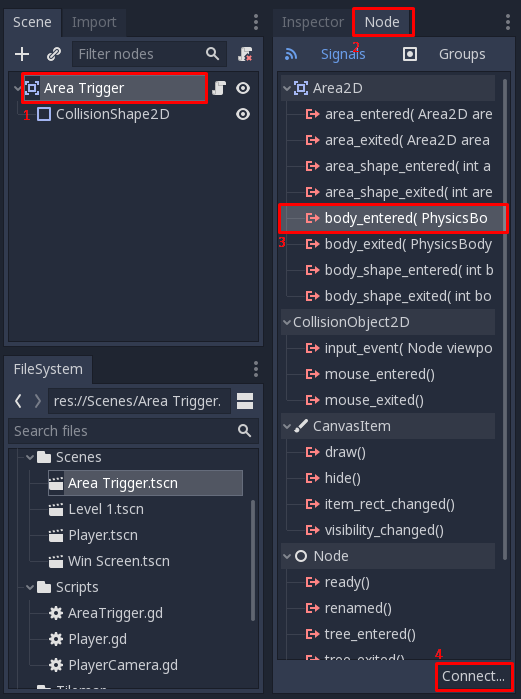

Pastikan ```Area2D``` terpilih pada bagian ```Connect To Node```, isi ```Method In Node``` dengan nama fungsi yang kamu inginkan atau biarkan default.
Jika sudah tekan tombol ```Connect```

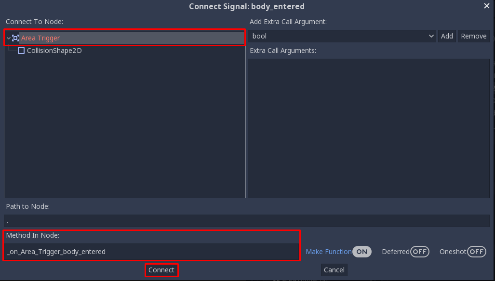

Maka script pada ```Area2D``` akan ditambah fungsi tersebut.

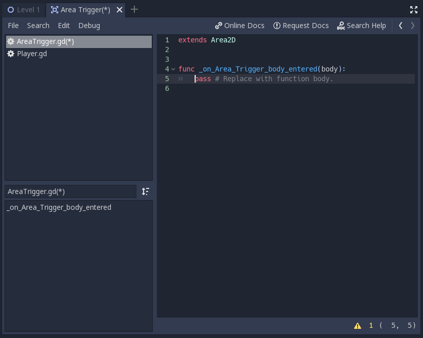

Silakan tambah cuplikan dibawah pada script tersebut. (Jangan lupa ganti nama fungsi sesuai penamaan masing-masing)
```
extends Area2D

export (String) var sceneName = "Level 1"

func _on_Area_Trigger_body_entered(body):
    if body.get_name() == "Player":
        get_tree().change_scene(str("res://Scenes/" + sceneName + ".tscn"))
```

Secara singkat fungsi tersebut akan tereksekusi setiap ada object dengan tipe ```PhysicsBody2D``` yang masuk area collision.
Jika object tersebut adalah player, maka ubah root node (current scene) dengan variabel ```sceneName```.

### Adding It to the Level

Save scene dan script tersebut (Mulai sekarang disebut ```AreaTrigger```) dan buka kembali scene ```Level 1.tscn```.
Supaya pemain dapat jelas melihat goal, tambah node dengan tipe ```Sprite``` sebagai child dari node ```Level 1``` dan ubah ```Texture``` menjadi ~~rektorat~~ roket atau bebas.

Kemudian tambahkan scene ```AreaTrigger``` sebagai child dari sprite tersebut, silakan atur scaling sesuai keperluan.
Jangan lupa ubah variable ```Scene Name``` menjadi "Win Screen".

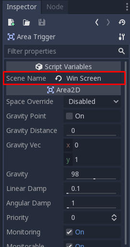

Lakukan hal yang sama untuk area dibawah level namun dengan ```Scene Name``` diisi dengan "Level 1".
Supaya ketika player jatuh ke jurang, scene akan di-reload.

Berikut contoh Level 1 yang sudah lengkap.

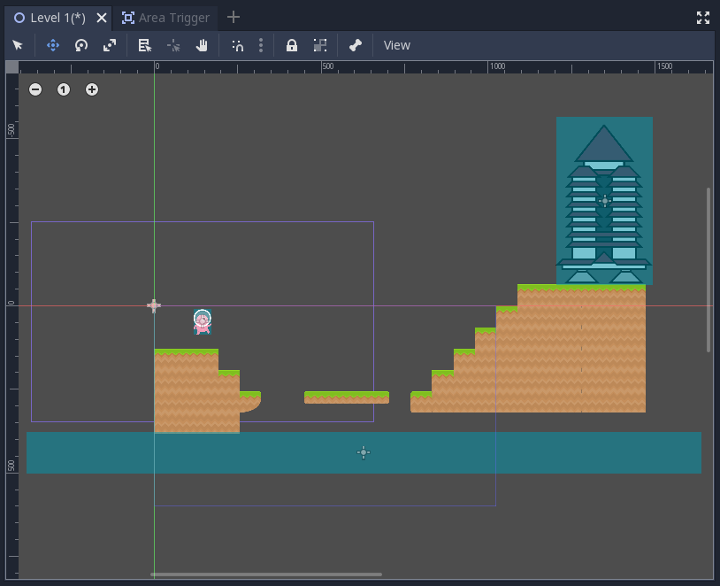

Selamat, tutorial ini sudah selesai!

## Bonus To Do

Apabila masih ada waktu atau ingin lanjut berlatih mandiri, silakan baca referensi yang tersedia untuk belajar mengimplementasikan fitur tambahan.
Tidak ada kriteria khusus untuk ini, kamu bebas menambahkan apapun yang kamu suka. Beberapa contoh yang bisa diimplementasikan:
- Background Image/Objects
- 2nd Level
- dll.

Jika mengerjakan fitur tambahan, buat file baru bernama ```T4_[NPM].md``` dimana ```[NPM]``` adalah NPM kamu (misal: ```t4_1506757913```) di folder yang sama dengan ```readme.md``` ini.
Tulis teks menggunakan format [Markdown](https://docs.gitlab.com/ee/user/markdown.html).

## Instruksi Pengerjaan

1. Dalam repositori pribadi kamu, silakan sinkronisasi _branch_ ```master``` dengan repositori _upstream_.
   Instruksi lebih lanjut bisa dibaca [disini](https://help.github.com/en/articles/syncing-a-fork).
2. Jika terdapat _conflict_, mohon diselesaikan secara damai.
   Jika tidak yakin bagaimana caranya, silakan ambil mata kuliah *Advanced Programming* atau baca [ini](https://help.github.com/en/articles/resolving-a-merge-conflict-using-the-command-line).
3. Setelah semua selesai, buat _branch_ baru dari _branch_ ```master``` dengan nama ```tutorial-x``` dimana ```x``` adalah nomor tutorial (misal: tutorial-4).
4. Ganti _current branch_ menjadi ```tutorial-x``` tersebut, silakan kerjakan tutorial di dalam _branch_ yang bersangkutan.
   Setiap _branch_ tutorial **tidak perlu** di _merge_ ke _branch_ ```master```.

## Skema Penilaian

Pada tutorial ini, ada empat kriteria nilai yang bisa diperoleh:

1. **A** apabila kamu mengerjakan tutorial dan latihan melebihi dari ekspektasi
   tim pengajar.
2. **B** apabila kamu hanya mengerjakan tutorial sesuai yang diminta oleh
   deskripsi tutorial.
3. **C** apabila kamu mengerjakan tutorial secara minimalis atau tidak
   lengkap/tuntas.
4. **E** apabila kamu tidak mengerjakan apapun atau tidak mengumpulkan.

## Pengumpulan

Kumpulkan dengan memasukkan berkasnya ke dalam Git dan _push_ ke _fork_ materi
tutorial ini di repositori milik pribadi. **Jangan _push_ atau membuat Merge
Request ke repositori _upstream_ materi tutorial kecuali jika kamu ingin
kontribusi materi atau memperbaiki materi yang sudah dipublikasikan!**

Tenggat waktu pengumpulan adalah **Sabtu, 28 September 2019, pukul 21:00**.

## Referensi

- [Tilemaps](https://docs.godotengine.org/en/3.1/tutorials/2d/using_tilemaps.html)
- [Signals](https://docs.godotengine.org/en/3.1/getting_started/step_by_step/signals.html)
- [Kenney Assets](https://www.kenney.nl/assets/platformer-pack-redux)
