# Tutorial 5 - Assets Creation & Integration

Selamat datang pada tutorial kelima kuliah Game Development. Pada tutorial
kali ini, kamu akan mempelajari cara membuat game asset sederhana menggunakan tools yang sesuai kemudian mengintegrasikan ke game.
Di akhir tutorial ini, diharapkan kamu paham dengan penggunaan _Spritesheet_ dan _Audio_.

## Daftar Isi

- [Tutorial 5 - Assets Creation & Integration](#Tutorial-5---Assets-Creation-&-Integration)
  - [Daftar Isi](#daftar-isi)
  - [Pengantar](#pengantar)
    - [What Is a Game Asset?](#what-is-a-game-asset)
  - [Set Up](#set-up-[penting]) 
  - [Visual Game Assets](#visual_game_assets)
    - [What is a Sprite Sheet?](#what_is_a_sprite_sheet?)
    - [AnimatedSprite vs (AnimationPlayer + AnimationTree)](#AnimatedSprite_vs_(AnimationPlayer_+_AnimationTree))
    - [Membuat Animasi dengan AnimatedSprite](#Membuat_Animasi_dengan_AnimatedSprite)
  - [Audio Game Assets](#audio_game_assets)
    - [Background Music (BGM) Implementation](#Background_Music_(BGM)_Implementation)
    - [Introduction to Sound Editing Tools](#Introduction_to_Sound_Editing_Tools)
  - [Bonus To Do](#bonus-to-do)
  - [Instruksi Pengerjaan](#Instruksi-Pengerjaan)
  - [Skema Penilaian](#skema-penilaian)
  - [Pengumpulan](#pengumpulan)
  - [Referensi](#referensi)

## Pengantar

### What Is Game Asset?

Pada tutorial sebelumnya kita sudah membuat sebuah _level_ sederhana menggunakaan TileMap beserta mekanik kamera dan _trigger area_. Namun sebelum membuat suatu _level_ dalam game, dibutuhkan hal-hal yang menggambarkan tampilan dan suasana dalam game, yang lebih dikenal sebagai *Game Asset*. Game asset meliputi:
- Desain 2D/3D
    - Karakter
    - Objek
    - Environment
- GUI
    - HUD
    - Icons
- Audio
    - BGM
    - SFX

Sebagian besar coder tidak bertugas untuk mendesain visual dan mengaransemen musik, tetapi coder harus dapat mengimplementasikan assets ke dalam game. Maka dari itu, tutorial ini akan menjelaskan tentang:
- Apa itu _spritesheet_ dan cara menggunakannya dalam animasi
- Penggunaan _audio clip_ sebagai game sound effects

Tutorial ini dapat menggunakan project godot dari Tutorial 3. Oleh sebab itu, **copy seluruh directory project godot kalian dari directory Tutorial 3 ke directory Tutorial 5**.

## Set Up [PENTING]

Tim asisten hanya menyediakan **satu _spritesheet_** dan **satu _audio file_ wav** pada tutorial kali ini. Maka dari itu, pertama-tama copy directory T3 dari tutorial 3 yang sudah dikerjakan minggu lalu ke directory tutorial-5. Kemudian, pindahkan directory **sound** dan **spritesheet** ke dalam directory Assets dalam directory T5.

## Visual Game Assets

### What is a Sprite Sheet?

```Sprite Sheet``` adalah file gambar *bitmap* yang berisi beberapa gambar yang lebih kecil dalam susunan *grid*. Dengan mengompilasi beberapa gambar menjadi satu file, kamu dapat membuat animasi hanya dengan memuat satu file. Efisiensi pemuatan ini dapat membantu dalam berbagai situasi, salah satunya *game development* dimana *performance* sangat penting dan sangat meminimalkan penggunaan *resource*.


Pembuatan *sprite sheet* tidak bergantung pada *tools*. Namun, *sprite sheet* lebih menekankan pada peletakan koordinat gambar pada satu file. Jika penempatan gambar per *frame* tidak rapih, sprite yang dihasilkan juga akan tidak sesuai dan terlihat aneh. Berikut *tools* untuk membuat *game assets* untuk dimasukkan ke dalam *sprite sheet*.

* Pixel Art
    * [PiskelApp](https://www.piskelapp.com/)
    * [Pixie](https://pixieengine.com/)
    * [Pixlr](https://pixlr.com/)
* Vector Art
    * [Adobe Illustrator](https://www.adobe.com/sea/products/illustrator.html)
    * [Figma](https://www.figma.com/)
* Raster Art
    * [Procreate](https://procreate.art/)
    * [IbisPaint](https://ibispaint.com)

Pembuatan aset secara manual tentu membutuhkan waktu dan keahlian. Saat ini sudah banyak tempat di internet yang menyediakan asset-asset visual secara gratis. Walaupun gratis, jangan lupa membaca license dari asset tersebut! Berikut adalah beberapa web yang menyediakan asset visual secara gratis.

* https://kenney.nl/assets
* https://www.gameart2d.com/freebies.html
* https://craftpix.net/freebies/

### AnimatedSprite vs (AnimationPlayer + AnimationTree)

Terdapat dua metode untuk membuat animasi dalam godot, yaitu dengan menggunakan ```AnimatedSprite``` atau dengan menggunakan ```AnimationPlayer``` bersama dengan ```AnimationTree```.

```AnimatedSprite``` memungkinkan kamu untuk membuat animasi dengan cara **mengganti gambar secara cepat**. Kecepatan pergantian *frame* gambar diatur dengan menggunakan satuan *frame per second*. Metode ini merupakan metode paling sederhana untuk membuat animasi di godot. Metode ini juga lebih sering digunakan untuk membuat animasi pada karakter atau *game objects*.

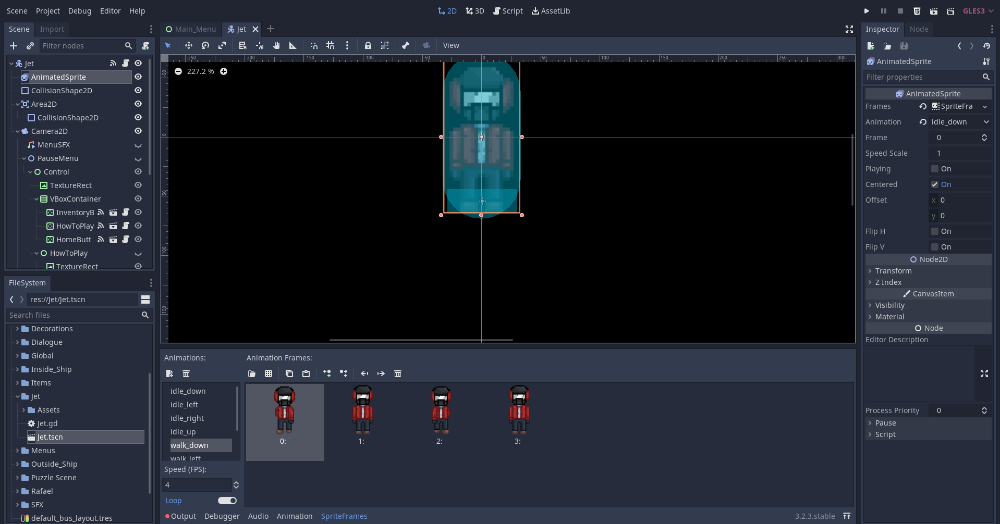

Di sisi lain ```AnimationPlayer``` digunakan untuk membuat animasi yang lebih kompleks. ```AnimationPlayer``` memungkinkan kamu untuk menyimpan perubahan *property*. Sebagai contoh, kamu dapat *load spritesheet* di node ```Sprite``` dan menyimpan perubahannya dalam bagian dari gambar yang saat ini sedang ditampilkan. Hal ini akan terlihat seperti kamu sedang menggunakan node ```AnimatedSprite```.

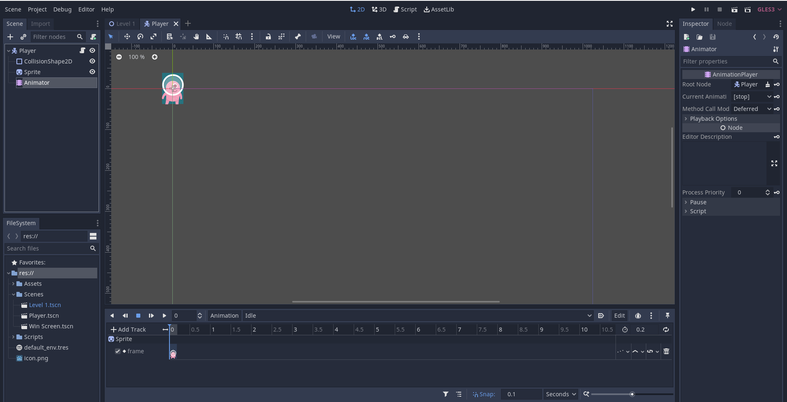

```AnimationTree``` memungkinkan kamu untuk membuat *paths* di antara animation. Misalnya *path idle -> walk -> run*. Ketika karakter diam (*idle*) dan kemudian lari secara langsung, ```AnimationTree``` akan memainkan animasi *walk* terlebih dahulu sebelum *run*.


### Membuat Animasi dengan AnimatedSprite

Tutorial ini akan menggunakan tutorial 3 yang masih asli (terdapat di branch master). Kalian bebas menggunakan tutorial 3 yang sudah kalian buat sebelumnya atau yang masih ada di branch master kalian.

1. Buat scene baru untuk membuat player dengan struktur seperti dibawah ini (jika sudah ada maka hanya perlu merubah node sprite menjadi ```AnimatedSprite```). 

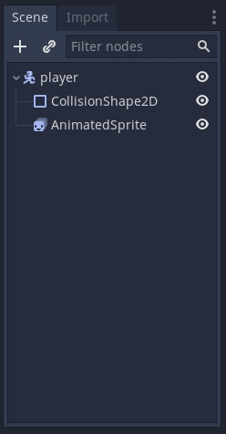

2. Selanjutnya adalah membuat **frame baru** untuk menempatkan sprite-sprite menjadi sebuah animasi

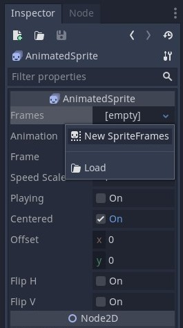

3. Setelahnya akan keluar window dibagian bawah untuk membuat animasi. Beri nama pada animasi yang ingin kalian buat dengan menekan 2x pada tulisan default 

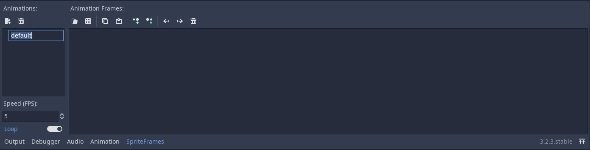 

4. Di tutorial ini akan membuat contoh animasi berjalan menghadap kanan (nama animasinya jalan_kanan). Setelah memberi nama, selanjutnya adalah mengimport gambar untuk dijadikan animasi. Ada **dua teknik** yaitu dengan langsung memasukan file gambar yang berisi satu gambar utuh (button 1), atau dengan memasukan file spritesheet (button 2). 

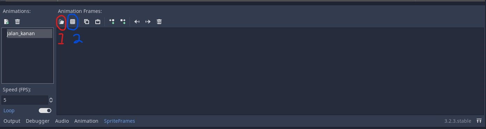

* Import gambar dengan menggunakan button 1 hanya tinggal menekan button 1 dan memilih file gambar yang ingin di import (ingat, teknik ini akan mengimport keseluruhan gambar dalam file).

* Import gambar dengan button 2 sedikit berbeda. Disini pilih file yang berisi spritesheet dan akan muncul tampilan grid seperti dibawah ini. 

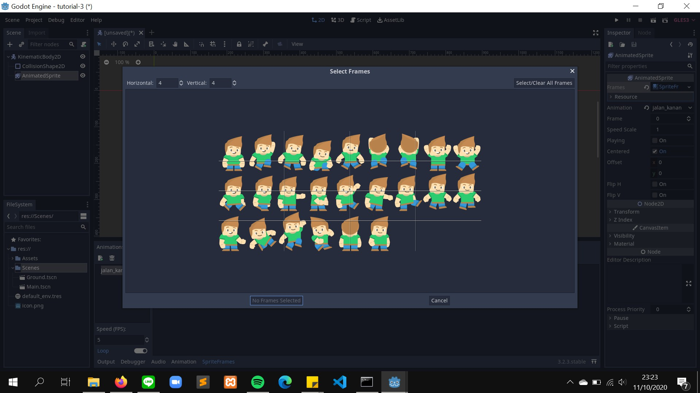

Disini kalian harus mengatur banyaknya grid yang agar setiap satu grid mewakili satu gambar yang akan di import. Pada kasus ini ubah horizontal menjadi 9 (karena jumlah gambar pada satu baris ada 9), dan vertikal menjadi 3 (karena terdapat 3 baris). Selanjutnya pilih gambar dengan menekan grid yang diinginkan (disini bisa memilih multiple gambar). 

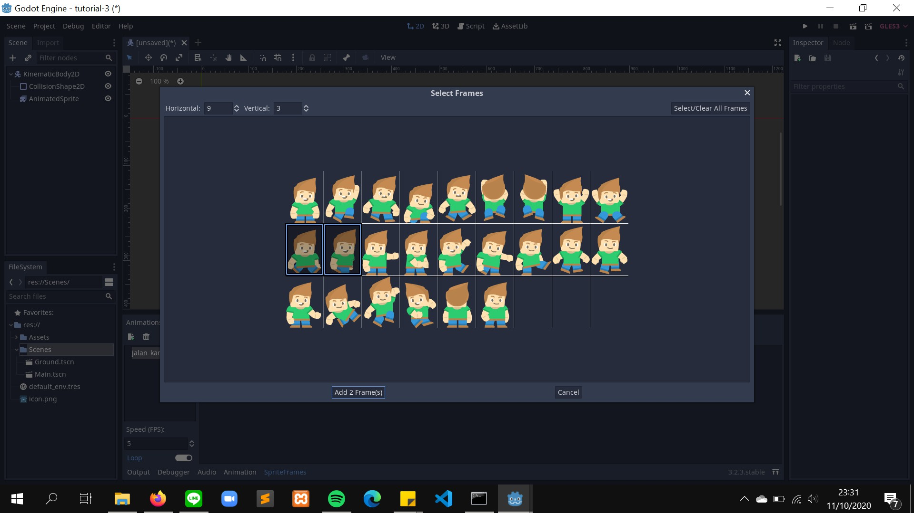

5. Selanjutnya untuk mencoba apakah animasi sudah seperti yang diinginkan dengan menceklis box playing pada inspector node animatedSprite. (jika animasi terlalu lambat, bisa menambahkan fps di bagian pojok kiri bawah diatas tombol output. Untuk pengulangan animasi, bisa mengaktifkan loop dibawah fps) 

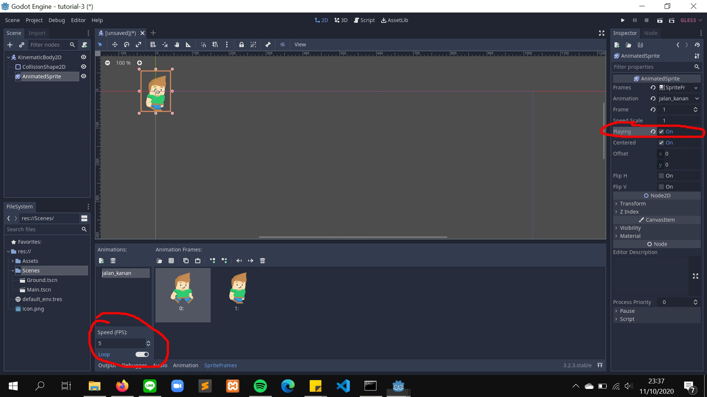

6. Animasi telah siap digunakan. Tetapi jika kalian lihat, saat menjalankan scene posisi player akan mengikuti texture pertama pada animasi jalan_kanan. Maka dari itu sebaiknya kalian membuat beberapa animasi untuk kasus lainnya. Untuk menyatakan animasi mana yang menjadi inisiasi player saat main scene dijalankan, bisa mengaturnya pada properti animations yang berapa pada inspector node animatedSprite. (disini scene playernya diberinama player.tscn, dengan root node bernama player) 

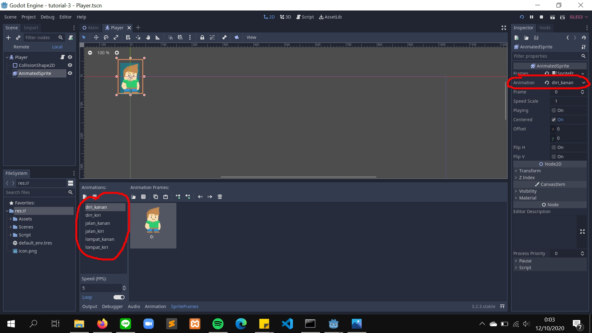

7.  Terakhir tentunya adalah membuat script untuk mengaktifkan animasi ini. Berikut adalah kode yang diambil dari tutorial 3. 
```
extends KinematicBody2D

export (int) var speed = 400
export (int) var jump_speed = -600
export (int) var GRAVITY = 1200

const UP = Vector2(0,-1)

var velocity = Vector2()

func get_input():
  velocity.x = 0
  if is_on_floor() and Input.is_action_just_pressed('up'):
    velocity.y = jump_speed
  if Input.is_action_pressed('right'):
    velocity.x += speed
  if Input.is_action_pressed('left'):
    velocity.x -= speed

func _physics_process(delta):
  velocity.y += delta * GRAVITY
  get_input()
  velocity = move_and_slide(velocity, UP)
```

8. Fungsi utama untuk mengaktifkan animasi adalah dengan `[nama_node_animatedSprite.play("nama_animasi")`. Coba perbarui fungsi `get_input()` dengan kode ini dan jalankan lagi main scene dengan menekan tombol keyboard kanan untuk menjalankan player. 
```
func get_input():
  var animation = "diri_kanan"
  
  velocity.x = 0
  if is_on_floor() and Input.is_action_just_pressed('up'):
    velocity.y = jump_speed
  if Input.is_action_pressed('right'):
    velocity.x += speed
    animation = "jalan_kanan"
  if Input.is_action_pressed('left'):
    velocity.x -= speed
  
  if $AnimatedSprite.animation != animation:
    $AnimatedSprite.play(animation)
```

 `$AnimatedSprite` merupakan nama dari node dengan tipe animatedSprite. Kalian bisa melengkapi program diatas menjadi animasi lengkap sampai menunduk, lompat, atau animasi lainnya.  

## Audio Game Assets

Suara di dalam game merupakan pelengkap yang harus ada dalam setiap game. Suara ini dapat menggambarkan suasana, seperti bahagia, sedih, mendebarkan, dan sebagainya. Dengan menambahkan suara yang sesuai, pengalaman pemain akan meningkat drastis.

Suara dalam game biasa dibuat dengan menggunakan *sound editing tools*, seperti [FMOD](https://www.fmod.com/), [Wwise](https://www.audiokinetic.com/), dan [Audacity](https://www.audacityteam.org/) (Open Source). Dengan menggunakan *sound editing tools*, *game music composer* dapat membuat *game asset* mulai dari efek suara hingga musik yang mendukung penggambaran suasana game. 

Seperti dalam pembuatan visual, penggunaan *sound editing tools* tentunya juga membutuhkan keahlian tersendiri. Maka dari itu, ada alternatif lain untuk *coder* yang ingin menambahkan SFX dalam game, yaitu dengan menggunakan *free sound* dari internet. Berikut website sumber efek suara yang gratis.

* https://kenney.nl/assets?q=audio
* https://freesound.org/
* http://soundbible.com/

Walaupun kalian menggunakan suara gratis dari sumber-sumber di atas, jangan lupa berikan credit yang sesuai sebagai bentuk apresiasi kepada pembuat audio.

### Introduction to Sound Editing Tools

Sebelum mempelajari implementasi sound di godot, pertama-tama kita pelajari dulu salah satu *sound editing tools*. Tools yang digunakan kali ini adalah *tools open source*, yaitu **Audacity**. Sebelum memulai tutorial bagian ini, *download* dan *install* Audacity terlebih dahulu melalui [link berikut](https://www.audacityteam.org/download/). 

Berikut tampilan dari Audacity.


Audacity dapat merekam suara menggunakan microphone, membuka audio file, trimming audio, serta mengaplikasikan efek ke audio. Pertama, buat **audio track** melalui tab track pada toolbar dan pilih add new -> stereo track.

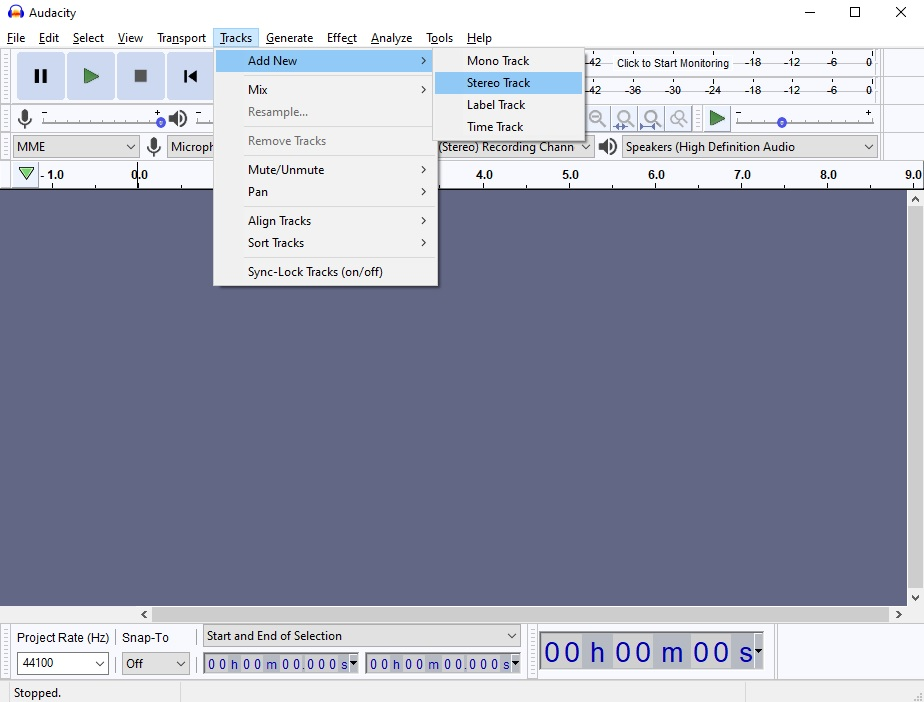

Track ini dapat diisi dengan suara hasil **rekaman**. Untuk memulai rekaman, tekan R atau tekan tombol rekaman. Jika sudah selesai merekam, tekan tombol stop.

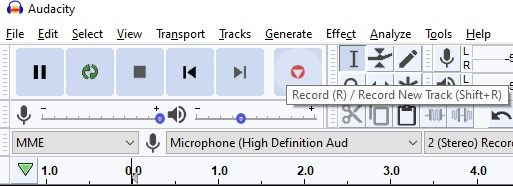

Hasil rekaman akan otomatis terisi ke dalam track. Namun, saat ini suara tersebut masih penuh noise. Untuk mengurangi noise tersebut dapat menggunakan effect **_noise reduction_**. Pertama, select interval audio track yang akan diberi effect. Kemudian, pilih effects pada toolbar dan pilih noise reduction.

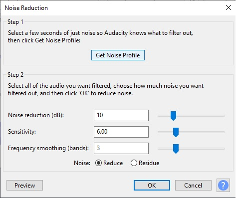

Selanjutnya tekan noise profile agar Audacity dapat mengetahui jenis noise yang akan difilter. Lalu pilih efek noise reduction lagi dari toolbar untuk memunculkan noise reduction settings dan atur sesuai kebutuhan. Jika sudah, klik OK. Audacity akan mengolah suara dan memfilter noise dari suara.

Jika sudah selesai membuat audio, audio ini dapat diexport ke bentuk yang dapat digunakan di godot. Godot hanya support dua jenis audio file, yaitu **wav** dan **ogg**. Oleh karena itu, export audio dengan cara memilih file pada toolbar dan pilih export -> export as wav.

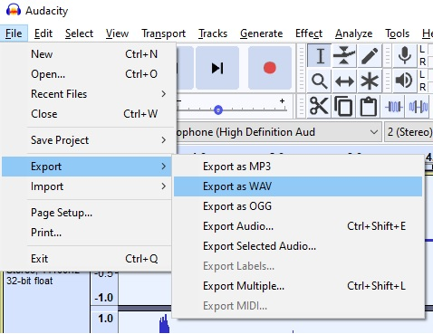

Audio yang sudah diexport dapat disimpan ke dalam folder Assets pada project godot kalian.

### Background Music (BGM) Implementation

Selain SFX, terdapat juga audio yang dapat menggambarkan suasana game, yaitu **Background Music**. Berikut cara mengimplementasikan BGM dalam game. Pertama buka level scene yang telah kamu buat. Kemudian tambahkan node ```AudioStreamPlayer``` sebagai child dari root node.

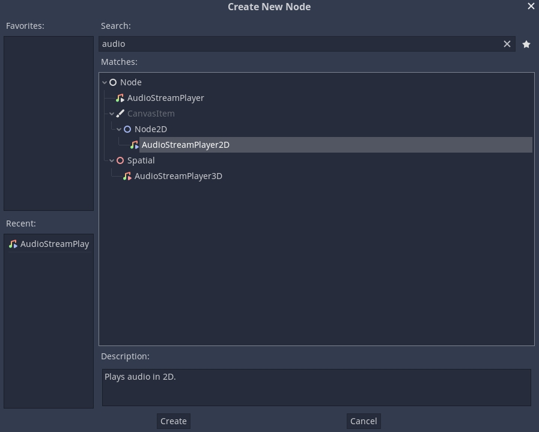

Lihat pada tab inspector di sebelah kanan. Untuk menambahkan audio ke dalam node ```AudioStreamPlayer```, klik dropdown pada bagian stream dan pilih load.

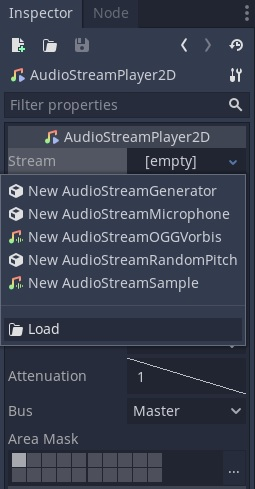

Godot akan memunculkan *prompt* untuk memilih file. Pilih file `bgm.wav` pada directory `res://Assets/sound`

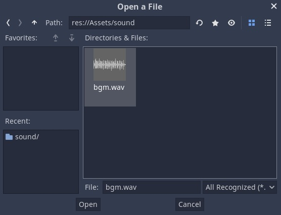

Setelah file audio dipilih, audio wave akan muncul pada bagian stream di tab inspector.

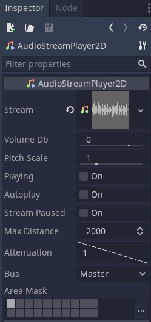

Terdapat beberapa konfigurasi lainnya, yaitu:

* Volume db: Mengatur volume audio.
* Pitch scale: Mengatur pitch audio.
* Playing: Jika on(true), audio akan diplay saat itu juga.
* Autoplay: Jika on(true), audio akan langsung diplay saat scene pertama kali dibuka.
* Stream paused: Jika on(true), playback akan dipause.
* Max Distance: Jarak maksimal hingga audio tidak bisa didengar (digunakan ketika ```AudioStreamPlayer``` merupakan child dari suatu *game object*).
* Attenuation: Memperkecil audio berdasarkan jarak secara eksponensial.
* Bus: Menentukan bus mana audio akan dimainkan.

Untuk penjelasan lebih lanjut mengenai ```AudioStreamPlayer``` dapat diakses di [docs](https://docs.godotengine.org/en/stable/classes/class_audiostreamplayer2d.html)

Saat ini *audio* masih berjalan tanpa *looping*. Untuk membuat *audio looping*, pilih file ```bgm.wav``` pada tab ```FileSystem``` di sebelah kiri bawah. Kemudian, buka tab ```Import``` di sebelah kiri atas. Berikut tampilan dari tab ```Import```.

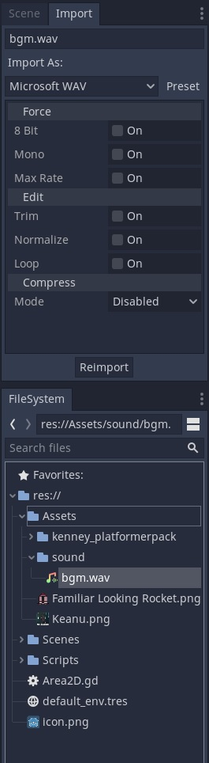

Klik *loop* lalu klik *reimport*. Godot akan mengimport audio ulang dengan menambahkan konfigurasi yang sudah dipilih sebelumnya. Tes apakah *audio* sudah *looping* dengan menjalankan *scene*.


## Bonus To Do

Apabila masih ada waktu atau ingin lanjut berlatih mandiri, silakan eksplor lebih lanjut mengenai spritesheet dan audio.
Tidak ada kriteria khusus untuk ini, kamu bebas menambahkan apapun yang kamu suka. Beberapa contoh yang bisa diimplementasikan:

- Melengkapi animasi player
- Membuat animasi lain sebagai dekorasi atau apapun
- SFX hasil buatan sendiri
- Audio yang relatif terhadap posisi node
- dll.

Jika mengerjakan fitur tambahan, buat file baru bernama ```T5_[NPM].md``` dimana ```[NPM]``` adalah NPM kamu (misal: ```T5_1506757913```) di folder yang sama dengan ```readme.md``` ini.
Tulis teks menggunakan format [Markdown](https://docs.gitlab.com/ee/user/markdown.html).

## Instruksi Pengerjaan

1. Dalam repositori pribadi kamu, silakan sinkronisasi _branch_ ```master``` dengan repositori _upstream_.
   Instruksi lebih lanjut bisa dibaca [disini](https://help.github.com/en/articles/syncing-a-fork).
2. Jika terdapat _conflict_, mohon diselesaikan secara damai.
   Jika tidak yakin bagaimana caranya, silakan ambil mata kuliah *Advanced Programming* atau baca [ini](https://help.github.com/en/articles/resolving-a-merge-conflict-using-the-command-line).
3. Setelah semua selesai, buat _branch_ baru dari _branch_ ```master``` dengan nama ```tutorial-x``` dimana ```x``` adalah nomor tutorial (misal: tutorial-4).
4. Ganti _current branch_ menjadi ```tutorial-x``` tersebut, silakan kerjakan tutorial di dalam _branch_ yang bersangkutan.
   Setiap _branch_ tutorial **tidak perlu** di _merge_ ke _branch_ ```master```.

## Skema Penilaian

Pada tutorial ini, ada empat kriteria nilai yang bisa diperoleh:

1. **A** apabila kamu mengerjakan tutorial dan latihan melebihi dari ekspektasi
   tim pengajar.
2. **B** apabila kamu hanya mengerjakan tutorial sesuai yang diminta oleh
   deskripsi tutorial.
3. **C** apabila kamu mengerjakan tutorial secara minimalis atau tidak
   lengkap/tuntas.
4. **E** apabila kamu tidak mengerjakan apapun atau tidak mengumpulkan.

## Pengumpulan

Kumpulkan dengan memasukkan berkasnya ke dalam Git dan _push_ ke _fork_ materi
tutorial ini di repositori milik pribadi. **Jangan _push_ atau membuat Merge
Request ke repositori _upstream_ materi tutorial kecuali jika kamu ingin
kontribusi materi atau memperbaiki materi yang sudah dipublikasikan!**

Tenggat waktu pengumpulan adalah **Jumat, 16 Oktober 2020, pukul 21:00**.

## Referensi

- [Tilemaps](https://docs.godotengine.org/en/3.1/tutorials/2d/using_tilemaps.html)
- [Signals](https://docs.godotengine.org/en/3.1/getting_started/step_by_step/signals.html)
- [Kenney Assets](https://www.kenney.nl/assets/platformer-pack-redux)
- Materi tutorial pengenalan Godot Engine, kuliah Game Development semester
  gasal 2020/2021 Fakultas Ilmu Komputer Universitas Indonesia.