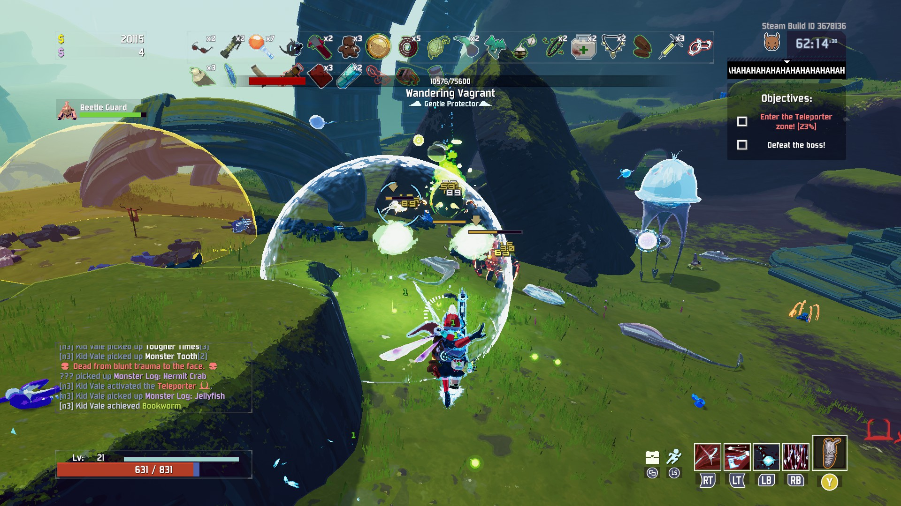

# Tutorial 6 - Basic 3D Game Mechanics

Selamat datang pada tutorial keenam kuliah Game Development. Pada tutorial
kali ini, kamu akan mempelajari cara membuat game dalam bentuk tiga dimensi (3D).
Di akhir tutorial ini, diharapkan kamu paham cara menggunakan *node* 3D,
penggunaan matematika untuk mengembangkan game 3D,
dan cara berinteraksi dengan objek lain dengan *raycast*.

## Daftar isi

- [Tutorial 6 - Basic 3D Game Mechanics](#tutorial-6---basic-3d-game-mechanics)
  - [Daftar isi](#daftar-isi)
  - [Pengantar](#pengantar)
    - [2D vs 3D](#2d-vs-3d)
    - [Objectives & Prerequisites](#objectives--prerequisites)
  - [Basic 3D Plane Movement](#basic-3d-plane-movement)
  - [Object Interaction](#object-interaction)
  - [Bonus To Do](#bonus-to-do)
  - [Instruksi Pengerjaan](#instruksi-pengerjaan)
  - [Skema Penilaian](#skema-penilaian)
  - [Pengumpulan](#pengumpulan)
  - [Referensi](#referensi)

## Pengantar

> Note: Tersedia template game untuk tutorial ini, namun tidak diwajibkan untuk menggunakannya.

### 2D vs 3D

Pada tutorial yang dilakukan sebelum masa UTS, kita sudah membuat game dua dimensi (2D)
dimana pemain dapat bergerak pada ruang dua dimensi. Pemain dapat bergerak ke atas,
bawah, kiri, dan kanan. Pada game 3D, terdapat sumbu tambahan pada ruang koordinat,
yaitu sumbu Z yang memberikan unsur kedalaman dan volume. Hal ini menyebabkan pengembangan
game 3D agak berbeda dengan 2D. Menggambar objek tidak menggunakan *sprite*, tetapi menggunakan
*tool* 3D khusus, yang kemudian di-*export* ke sebuah format agar dapat di-*import* ke Godot.
*Physics* juga berbeda dalam penggunaannya karena menggunakan vektor 3D.

Berikut adalah contoh perbedaan game 2D dan 3D.




> Risk of Rain (atas) dan Risk of Rain 2 (bawah)

### Objectives & Prerequisites

Pada tutorial ini kita akan membuat sebuah game *first-person* dimana pemain dapat bergerak,
melompat, dan berinteraksi dengan objek.

Dikarenakan pengembangan game 3D akan berbeda dengan 2D, perlu diketahui bahwa beberapa *node* yang sebelumnya
digunakan pada pengembangan game 2D tidak akan bekerja pada space 3D, sehingga kalian harus menggunakan
*node* yang dapat bekerja pada space 3D. Selain itu, kalian juga harus me-*review* kembali dasar-dasar
pelajaran Aljabar Linear dan Fisika Dasar karena *physics* pada space 3D lebih kompleks dibandingkan
dengan pada space 2D. Terakhir, terdapat koordinat baru, yaitu koordinat Z, yang digunakan untuk
menunjukkan arah depan/belakang.

## Basic 3D Plane Movement

Kita ingin membuat sebuah karakter yang dikendalikan oleh pemain di dunia 3D. Untuk itu,
kita akan membuat sebuah objek ```KinematicBody``` (mirip dengan ```Kinematic2D```) yang dapat bergerak ke semua arah dan dapat melompat.

Buat sebuah *Scene* baru, tambahkan *node* ```KinematicBody```, rename menjadi *Player*
dan tambahkan ```MeshInstance``` dan ```CollisionShape``` sebagai *child node* dari *node*
*Player*. Tambahkan satu lagi *child node* berupa ```Spatial```, rename menjadi *Head*, dan
tambahkan ```Camera``` sebagai *child node* dari *Head*.


Pada node ```CollisionShape```, pada tab *Inspector*, berikan sebuah ```Shape``` yaitu ```CapsuleShape``` untuk
memberi *collision* pada pemain, lalu putar sebesar 90 derajat pada sumbu x.


Pada node ```MeshInstance```, pada tab *Inspector*, berikan *mesh* dengan bentuk ```CapsuleMesh``` untuk
memberi wujud pada pemain, lalu putar sebesar 90 derajat pada sumbu x.


Pindahkan/translasikan *node Head* agar berada di ujung atas objek.

Agar pemain dapat bergerak, tambahkan *script* pada *node Player* dengan isi sebagai berikut:

```
extends KinematicBody

export var speed = 10
export var acceleration = 5
export var gravity = 0.98
export var jump_power = 30
export var mouse_sensitivity = 0.3

onready var head = $Head

var velocity = Vector3()

func _ready():
    Input.set_mouse_mode(Input.MOUSE_MODE_CAPTURED)

func _input(event):
    pass

func _process(delta):
    if Input.is_action_just_pressed("ui_cancel"):
        Input.set_mouse_mode(Input.MOUSE_MODE_VISIBLE)

func _physics_process(delta):
    var head_basis = head.get_global_transform().basis
    
    var movement_vector = Vector3()
    if Input.is_action_pressed("movement_forward"):
        movement_vector -= head_basis.z
    if Input.is_action_pressed("movement_backward"):
        movement_vector += head_basis.z
    if Input.is_action_pressed("movement_left"):
        movement_vector -= head_basis.x
    if Input.is_action_pressed("movement_right"):
        movement_vector += head_basis.x
    
    movement_vector = movement_vector.normalized()
    
    velocity = velocity.linear_interpolate(movement_vector * speed, acceleration * delta)
    velocity.y -= gravity
    
    if Input.is_action_just_pressed("jump") and is_on_floor():
        velocity.y += jump_power
    
    velocity = move_and_slide(velocity, Vector3.UP)
```

Pada *Project* > *Project Settings*, pada tab *Input Map*, tambahkan action `movement_forward`,
`movement_backward`, `movement_left`, `movement_right`, `jump` dan `interact` sebagai berikut
(akan digunakan nantinya):


Perhatikan bahwa:

1. ```head_basis``` merupakan vektor yang menunjukkan arah dari kepala pemain, sehingga jika
   menekan input untuk menggerakan pemain, ```movement_vector``` akan berisi
   arah sumbu x dari kepala pemain ketika bergerak ke kiri atau kanan, dan sumbu z dari kepala pemain
   ketika bergerak ke depan atau belakang.
2. Kita mengubah ```movement_vector``` menjadi ```movement_vector.normalized()```, karena
   jika diberikan input pada dua arah seperti ke depan dan ke kiri, maka pemain tidak akan
   maju dua kali lebih cepat.
3. Fungsi ```linear_interpolate``` berguna agar pergerakan pemain mulus sesuai dengan
   *acceleration* dari pemain ketika menekan input.
4. Fungsi ```move_and_slide``` berfungsi untuk menggerakan pemain.

Tambahkan *scene Player* ke *scene Level*, lalu coba jalankan *scene* tersebut. Pemain sudah dapat
bergerak, namun pemain tidak dapat menggerakan kamera menggunakan *mouse* untuk menghadap arah lain. Untuk itu,
tambahkan kode berikut:

```
...
onready var head = $Head
onready var camera = $Head/Camera

var velocity = Vector3()
var camera_x_rotation = 0

...

func _input(event):
	if event is InputEventMouseMotion and Input.get_mouse_mode() == Input.MOUSE_MODE_CAPTURED:
    head.rotate_y(deg2rad(-event.relative.x * mouse_sensitivity))

    var x_delta = event.relative.y * mouse_sensitivity
    if camera_x_rotation + x_delta > -90 and camera_x_rotation + x_delta < 90:
    	camera.rotate_x(deg2rad(-x_delta))
    	camera_x_rotation += x_delta
...
```

Kode tersebut berguna untuk merotasikan *node Head* ketika mouse bergerak, dan juga mencegah rotasi melebihi
90 derajat ketika melihat ke atas atau bawah.

## Object Interaction

Pada *scene Level*, terdapat sebuah node *switch* yang digunakan untuk menyalakan atau mematikan lampu *OmniLight*.
Agar objek *switch* tersebut dapat dilakukan sebuah interaksi (seperti mematikan dan menyalakan), tambahkan 2 buah script berikut:

> Interactable.gd

```
extends Node

class_name Interactable

func interact():
    pass
```

> Switch.gd (attach script ini pada node StaticBody di Switch)

```
extends Interactable

export var light : NodePath
export var on_by_default = true
export var energy_when_on = 1
export var energy_when_off = 0

onready var light_node = get_node(light)

var on = on_by_default

func _ready():
    light_node.set_param(Light.PARAM_ENERGY, energy_when_on)

func interact():
    on = !on
    light_node.set_param(Light.PARAM_ENERGY, energy_when_on if on else energy_when_off)
```

Perhatikan bahwa kita meng*extend class* ```Interactable``` pada *Switch*, agar kode dapat digunakan kembali
jika ingin membuat objek ```Interactable``` lain.

Pada bagian *inspector*, attach *OmniLight* sebagai isi dari variable *Light*, seperti berikut:


Agar pemain dapat berinteraksi dengan objek lain, kita dapat menggunakan *node* ```RayCast```. ```RayCast```
merepresentasikan sebuah garis dari suatu titik ke titik lain, dan menkueri objek terdekat yang
ditemuinya. Tambahkan *node* ```RayCast``` sebagai *child* dari *head* pemain. Pastikan
```RayCast``` menghadap arah yang sama dengan ```Camera``` dengan mengatur nilai *cast to* di *inspector*.


Pada *node* ```RayCast```, tambahkan *script* sebagai berikut:

```
extends RayCast

var current_collider

func _ready():
    pass

func _process(delta):
    var collider = get_collider()
    
    if is_colliding() and collider is Interactable:
        if Input.is_action_just_pressed("interact"):
            collider.interact()
```

Fungsi ini mengecek jika ```RayCast``` menyentuh sebuah objek lain yang berupa *Interactable*,
dan pemain dapat menekan tombol (misalnya E) untuk berinteraksi dengan objek tersebut. Dalam
kasus ini, berinteraksi dengan *switch* akan mematikan atau menyalakan lampu.

Selamat, kamu sudah menyelesaikan tutorial ini!

## Bonus To Do

Apabila masih ada waktu atau ingin lanjut berlatih mandiri, silakan baca referensi yang tersedia untuk belajar mengimplementasikan mekanik tambahan.
Tidak ada kriteria khusus untuk ini, kamu bebas menambahkan apapun yang kamu suka. Beberapa contoh yang dapat diimplementasikan:

- Item pickup
- Sprinting
- Crouching
- Estetika (User Interface dan penggunaan asset 3D)
- dll.

Jika mengerjakan fitur tambahan, buat file baru bernama `T6_[NPM].md` dimana
`[NPM]` adalah NPM kamu (misal: `T6_1506757913`) di folder yang sama dengan
[`README.md`](README.md) ini. Tulis teks menggunakan format [Markdown](https://docs.gitlab.com/ee/user/markdown.html).

## Instruksi Pengerjaan

1. Dalam repositori pribadi kamu, silakan sinkronisasi _branch_ `master` dengan
   repositori _upstream_. Instruksi lebih lanjut bisa dibaca [disini](https://help.github.com/en/articles/syncing-a-fork).
2. Jika terdapat _conflict_, mohon diselesaikan secara damai. Jika tidak yakin
   bagaimana caranya, silakan ambil mata kuliah *Advanced Programming* atau
   baca [ini](https://help.github.com/en/articles/resolving-a-merge-conflict-using-the-command-line).
3. Setelah semua selesai, buat _branch_ baru dari _branch_ `master` dengan nama
   `tutorial-x` dimana `x` adalah nomor tutorial (misal: `tutorial-6`).
4. Ganti _current branch_ menjadi `tutorial-x` tersebut, silakan kerjakan
   tutorial di dalam _branch_ yang bersangkutan. Setiap _branch_ tutorial
   **tidak perlu** di _merge_ ke _branch_ `master`.

## Skema Penilaian

Pada tutorial ini, ada empat kriteria nilai yang bisa diperoleh:

1. **A** apabila kamu mengerjakan tutorial dan latihan melebihi dari ekspektasi
   tim pengajar.
2. **B** apabila kamu hanya mengerjakan tutorial sesuai yang diminta oleh
   deskripsi tutorial.
3. **C** apabila kamu mengerjakan tutorial secara minimalis atau tidak
   lengkap/tuntas.
4. **E** apabila kamu tidak mengerjakan apapun atau tidak mengumpulkan.

## Pengumpulan

Kumpulkan dengan memasukkan berkasnya ke dalam Git dan _push_ ke _fork_ materi
tutorial ini di repositori milik pribadi. **Jangan _push_ atau membuat Merge
Request ke repositori _upstream_ materi tutorial kecuali jika kamu ingin
kontribusi materi atau memperbaiki materi yang sudah dipublikasikan!**

Tenggat waktu pengumpulan adalah **Sabtu, 9 November 2019, pukul 21:00**.

## Referensi

- [Godot 3D Tutorial](http://docs.godotengine.org/en/3.1/tutorials/3d/index.html)
- [Godot FPS Tutorial](http://docs.godotengine.org/en/3.1/tutorials/3d/fps_tutorial/index.html)
- [Kenney 3D Assets](https://www.kenney.nl/assets?q=3d)
