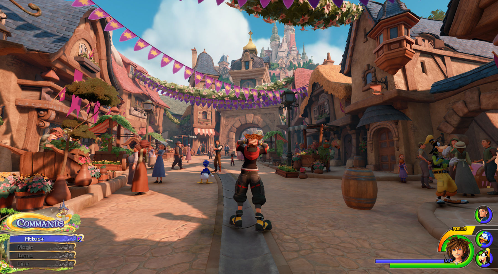
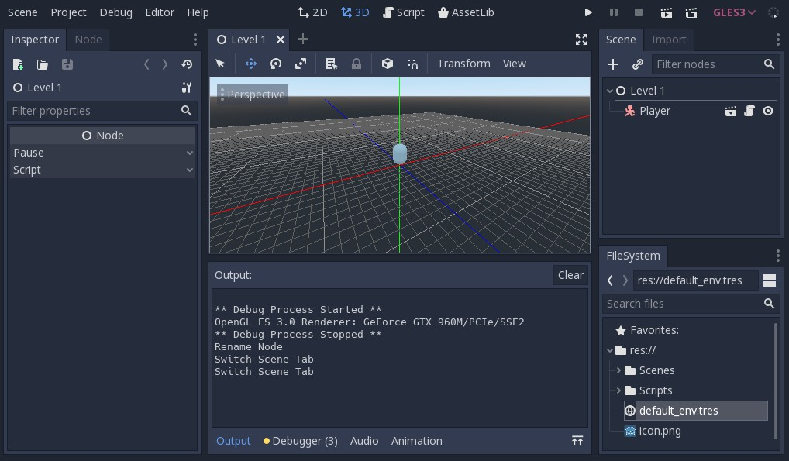
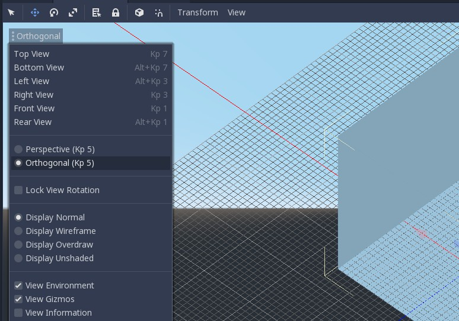
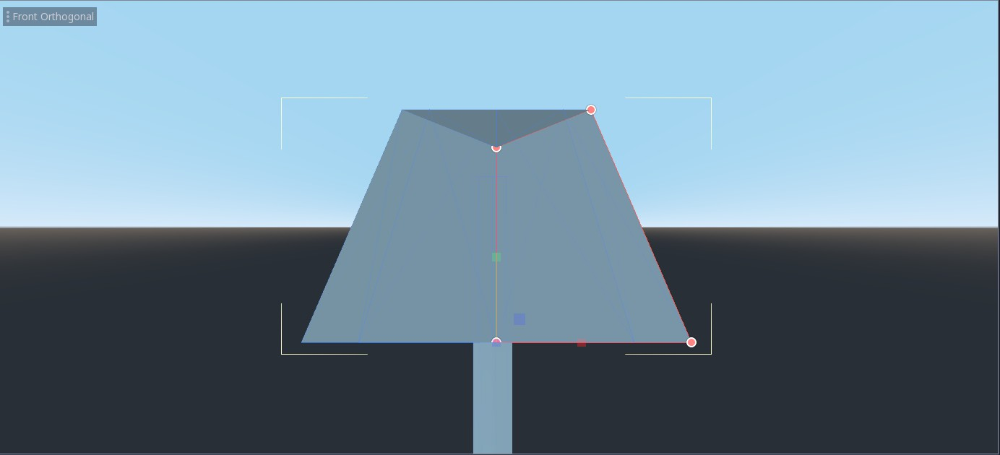
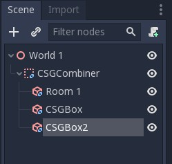
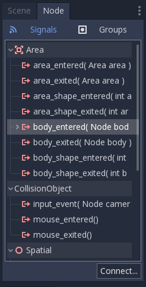

# Tutorial 7 - Basic 3D Level Design

Selamat datang pada tutorial ketujuh kuliah Game Development. Pada tutorial
kali ini, kamu akan mempelajari cara membuat 3D level sederhana menggunakan Godot Engine.
Di akhir tutorial ini, diharapkan kamu paham dengan penggunaan CSG.

## Daftar Isi

- [Tutorial 7 - Basic 3D Level Design](#Tutorial-7---Basic-3D-Level-Design)
  - [Daftar Isi](#daftar-isi)
  - [Pengantar](#pengantar)
    - [Apa itu CSG?](#apa-itu-csg)
    - [Fitur CSG](#fitur-csg)
    - [3D Level Example](#3d-level-example)
  - [Creating A Simple Level using CSG](#creating-a-simple-level-using-csg)
    - [Preparation](#preparation)
    - [Empty Room](#empty-room)
    - [Making 3D Objects](#making-3d-objects)
    - [Coloring 3D Objects](#coloring-3d-objects)
  - [Obstacles and Goal Condition](#obstacles-and-goal-condition)
    - [Adding Obstacles](#adding-obstacles)
    - [Adding Goal Condition](#adding-goal-condition)
    - [Set Up](#set-up)
    - [Using Signals](#using-signals)
    - [Adding It to the Level](#adding-it-to-the-level)
  - [Bonus To Do](#bonus-to-do)
  - [Instruksi Pengerjaan](#instruksi-pengerjaan)
  - [Skema Penilaian](#skema-penilaian)
  - [Pengumpulan](#pengumpulan)
  - [Referensi](#referensi)

## Pengantar

Pada tutorial sebelumnya, kita sudah mencoba untuk mengimplementasikan 
mekanik game 3D sederhanda menggunakan *node* 3D. Kali ini, kita akan mencoba
membuat level 3D menggunakan CSG (Constructive Solid Geometry).

> IMPORTANT: Pada tutorial ini diperbolehkan untuk melanjutkan dari tutorial
kemarin. Cukup copy folder T6 ke dalam folder T7 sebelum mulai.

### Apa itu CSG?

CSG atau *Constructive Solid Geometry* merupakan sebuah tool dalam Godot Engine
 untuk menggabungkan bentuk-bentuk 3D dasar/primitif seperti *Box* atau *Sphere* 
 agar tercipta suatu bentuk kompleks.
 
CSG biasa digunakan untuk prototyping level 3D. Jika anda ingin membuat level 3D
yang sudah production-quality, nantinya aset yang sudah dibuat dengan CSG bisa diganti
dengan model 3D yang dibuat dari 3DMax, Blender, atau software 3D modelling sejenisnya.

### Fitur CSG

Node CSG dalam Godot mempunyai 3 operasi boolean diantaranya:

- Union: Penggabungan bentuk primitif dengan menghilangkan intersection.
- Intersection: Membuat sisa bentuk hasil penggabungan, sisanya dihilangkan.
- Substraction: Bentuk primitif kedua hasil gabungan dihilangkan dari yang 
pertama dengan bagian yang menempel pada bentuk 1 juga hilang.

### 3D Level Example

Contoh 3D level design dalam beberapa game:




Kita akan membuat sebuah level 3D sederhana menggunakan salah satu fitur Godot Engine yaitu *CSG*.
Pada tutorial ini akan didemonstrasikan:
- Membuat 3D Object menggunakan CSG
- Membuat level menggunakan CSG
- Membuat trigger untuk lose dan win condition

## Creating A Simple Level using CSG

### Preparation

Buka template project di Godot Editor, kemudian buka scene ```Scenes/Level 1.tscn```.
Dalam scene tersebut akan terdapat player dengan script yang sudah kalian implementasikan pada
tutorial sebelumnya.



Klik kanan pada node ```Level 1``` dan pilih ```Add Child Node```, kemudian pilih ```Spatial```
dan rename node tersebut menjadi ```World 1```.

Setelah World 1 selesai dibuat, save node tersebut menjadi sebuah scene baru dengan klik kanan
pada node World 1 lalu klik ```Save Branch As Scene``` dengan nama ```World 1.tscn```.

### Empty Room

Masuk ke Editor Scene untuk World 1, disini kita akan memanfaatkan CSG untuk membuat ruangan kosong.
Pada Node World 1, buat child node baru dengan memilih ```CSGBox``` dan beri nama ```Room 1```. 

Pada tab Inspector cek ```Invert Faces``` untuk membuat mesh menjadi inverted seperti tampilan Box Kosong dan
juga Cek ```Use Collision``` agar player tidak jatuh ketika berada di dalam ruangan, untuk sekarang Operation
pada CSG yang kita buat masih menggunakan mode ```Union```. 

Masih pada tab Inspector, ubah ```Width```, ```Height```, dan ```Width``` dalam CSGBox sesuai keinginanmu lalu 
atur posisi box pada *Viewport*.


Save Scene tersebut lalu kembali ke Scene ```Level 1``` dan coba Play.

> Note: Anda dapat menambahkan Node OmniLight atau DirectionalLight untuk memudahkan pencahayaan pada saat membuat objek 3D.

### Making 3D Objects

Saat ini game terlihat membosankan, tidak ada gimmick apapun dan hanya ada ruang kosong. Kali ini kita akan mencoba
untuk membuat objek 3D untuk menghias room yang telah kita buat.

Untuk memudahkan penglihatan pada *viewport*, anda dapat mengubah proyeksi menjadi *Orthogonal* dengan mengklik menu
pojok kiri atas dalam *viewport*.



Buat sebuah 3D Scene baru dan beri nama ```ObjLamp```. Tambahkan child node baru dengan memilih ```CSGCombiner``` dan
beri nama ```lamp```. ```CSGCombiner``` berfungsi sebagai tempat untuk mengatur komponen CSG di dalamnya, jangan lupa
mencentang ```Use Collision``` karena objek yang akan dibuat merupakan benda padat.

Dalam ```lamp``` masukkan child note untuk membentuk bagian lampu.
- Buat ```CSGCylinder``` dengan cek *cone* pada tab Inspector untuk bagian bawah lampu.
- Buat ```CSGCylinder``` dan atur ukuran pada tab Inspector untuk menjadi tiang lampu.
- Buat ```CSGPolygon``` dengan memilih Mode *Spin* pada tab Inspector, lalu ubah proyeksi menjadi *Front View* dan atur
Titik pada polygon hingga membentuk trapesium untuk membentuk penutup lampu.




Setelah jadi, atur ketiga child node sehingga membentuk sebuah lampu! Save lalu masukkan Scene tersebut ke dalam Scene
 World 1 dengan klik kanan pada Node World 1 pilih ```Instance Child Scene```.

### Coloring 3D Objects

Masuk kembali pada Scene ```ObjLamp```. Untuk mewarnai penutup lampu, pilih CSGPolygon yang sudah dibuat lalu pada tab
Inspector klik dropdown ```Material``` dan pilih ```New SpatialMaterial```.


Setelah SpatialMaterial dipilih, klik gambar bola yang muncul pada menu ```Material```. Disini anda dapat mengatur tekstur
dari CSG yang dibuat, untuk sekarang klik menu ```Albedo``` dan ganti warna sesuai yang kalian inginkan.


Cara pewarnaan ini berlaku untuk semua objek CSG yang kalian buat kecuali ```CSGCombiner```.

## Obstacles and Goal Condition

Seperti yang sudah dipelajari pada Tutorial 4, sebuah level tidak lengkap tanpa tujuan akhir. Maka disini kita akan membuat
*Obstacle* dan *Goal Condition* agar game dapat berakhir.

### Adding Obstacles

Misalkan kita ingin menambahkan halangan untuk player dapat menuju goal seperti field yang berlubang atau jurang yang hanya dapat dilewati menggunakan function jump yang telah anda buat pada tutorial 6.

Buka Scene ```World 1```, lalu buat ```CSGCombiner``` baru dan centang ```Use Collision``` pada tab Inspector. Lalu masukkan Node ```Room 1``` ke dalam CSGCombiner yang telah dibuat. Tambahkan 2 ```CSGBox``` ke dalam CSGCombiner masing-masing akan menjadi room yang baru dan lubang. Atur sedemikian rupa menggunakan operation ```Union``` untuk membuat ruang baru dan lubang.




Lalu tambahkan ```CSGBox``` lagi diluar CSGCombiner agar player bisa melompati lubang untuk menyebrang.


### Adding Goal Condition

Pada tutorial 4 anda telah belajar menggunakan signals pada 2D level, kali ini kita akan mencoba menggunakan signals kembali untuk menambahkan goal condition.

### Set Up

Pertama buat scene baru (nama bebas) dengan ```Area``` sebagai root node.


Lalu tambahkan node ```CollisionShape``` sebagai child dari node ```Area``` tadi.
Jangan lupa untuk membuat _collision shape_ pada node ```CollisionShape``` (Kamu seharusnya sudah pernah melakukannya pada tutorial sebelumnya) kali ini buat bentuk *Sphere*.


Kemudian _attach_ sebuah script pada node ```Area``` (penamaan bebas).
Hapus semua baris kecuali baris pertama, kita akan menggunakan _Signals_ untuk fitur ini.

### Using Signals

Pertama select node ```Area``` lalu buka tab ```Node```.
Lalu pada subtab ```Signals``` pilih ```body_entered(Node body)``` dan klik tombol ```Connect``` di kanan bawah tab tersebut.



Pastikan ```Area``` terpilih pada bagian ```Connect To Node```, isi ```Method In Node``` dengan nama fungsi yang kamu inginkan atau biarkan default.
Jika sudah tekan tombol ```Connect```


Maka script pada ```Area``` akan ditambah fungsi tersebut.


Silakan tambah cuplikan dibawah pada script tersebut. (Jangan lupa ganti nama fungsi sesuai penamaan masing-masing)
```
extends Area

export (String) var sceneName = "Level 1"

func _on_Area_Trigger_body_entered(body):
    if body.get_name() == "Player":
        get_tree().change_scene(str("res://Scenes/" + sceneName + ".tscn"))
```

Secara singkat fungsi tersebut akan tereksekusi setiap ada object dengan tipe ```Node``` yang masuk area collision.
Jika object tersebut adalah player, maka ubah root node (current scene) dengan variabel ```sceneName```.

### Adding It to the Level

Save scene dan script tersebut (Mulai sekarang disebut ```AreaTrigger```) dan buka kembali scene ```Level 1.tscn```.

Kemudian tambahkan scene ```AreaTrigger``` sebagai child dari sprite tersebut, silakan atur scaling sesuai keperluan.
Jangan lupa ubah variable ```Scene Name``` menjadi "Win Screen".


Lakukan hal yang sama untuk area lubang namun dengan ```Scene Name``` diisi dengan "Level 1".
Supaya ketika player jatuh ke jurang, scene akan di-reload.

Selamat, tutorial ini sudah selesai!

## Bonus To Do

Apabila masih ada waktu atau ingin lanjut berlatih mandiri, silakan baca referensi yang tersedia untuk belajar mengimplementasikan fitur tambahan.
Tidak ada kriteria khusus untuk ini, kamu bebas menambahkan apapun yang kamu suka. Beberapa contoh yang bisa diimplementasikan:
- 3D Object dengan animasi
- Implementasi Interact dengan object untuk menyelesaikan puzzle
- 2nd Level
- Estetika
- dll.

Jika mengerjakan fitur tambahan, buat file baru bernama ```T7_[NPM].md``` dimana ```[NPM]``` adalah NPM kamu (misal: ```t7_1506757913```) di folder yang sama dengan ```readme.md``` ini.
Tulis teks menggunakan format [Markdown](https://docs.gitlab.com/ee/user/markdown.html).

## Instruksi Pengerjaan

1. Dalam repositori pribadi kamu, silakan sinkronisasi _branch_ ```master``` dengan repositori _upstream_.
   Instruksi lebih lanjut bisa dibaca [disini](https://help.github.com/en/articles/syncing-a-fork).
2. Jika terdapat _conflict_, mohon diselesaikan secara damai.
   Jika tidak yakin bagaimana caranya, silakan ambil mata kuliah *Advanced Programming* atau baca [ini](https://help.github.com/en/articles/resolving-a-merge-conflict-using-the-command-line).
3. Setelah semua selesai, buat _branch_ baru dari _branch_ ```master``` dengan nama ```tutorial-x``` dimana ```x``` adalah nomor tutorial (misal: tutorial-7).
4. Ganti _current branch_ menjadi ```tutorial-x``` tersebut, silakan kerjakan tutorial di dalam _branch_ yang bersangkutan.
   Setiap _branch_ tutorial **tidak perlu** di _merge_ ke _branch_ ```master```.

## Skema Penilaian

Pada tutorial ini, ada empat kriteria nilai yang bisa diperoleh:

1. **A** apabila kamu mengerjakan tutorial dan latihan melebihi dari ekspektasi
   tim pengajar.
2. **B** apabila kamu hanya mengerjakan tutorial sesuai yang diminta oleh
   deskripsi tutorial.
3. **C** apabila kamu mengerjakan tutorial secara minimalis atau tidak
   lengkap/tuntas.
4. **E** apabila kamu tidak mengerjakan apapun atau tidak mengumpulkan.

## Pengumpulan

Kumpulkan dengan memasukkan berkasnya ke dalam Git dan _push_ ke _fork_ materi
tutorial ini di repositori milik pribadi. **Jangan _push_ atau membuat Merge
Request ke repositori _upstream_ materi tutorial kecuali jika kamu ingin
kontribusi materi atau memperbaiki materi yang sudah dipublikasikan!**

Tenggat waktu pengumpulan adalah **Sabtu, 16 November 2019, pukul 21:00**.

## Referensi

- [CSG](https://docs.godotengine.org/en/3.1/tutorials/3d/csg_tools.html)
- [Signals](https://docs.godotengine.org/en/3.1/getting_started/step_by_step/signals.html)
- [Kenney 3D Assets](https://www.kenney.nl/assets?q=3d)
