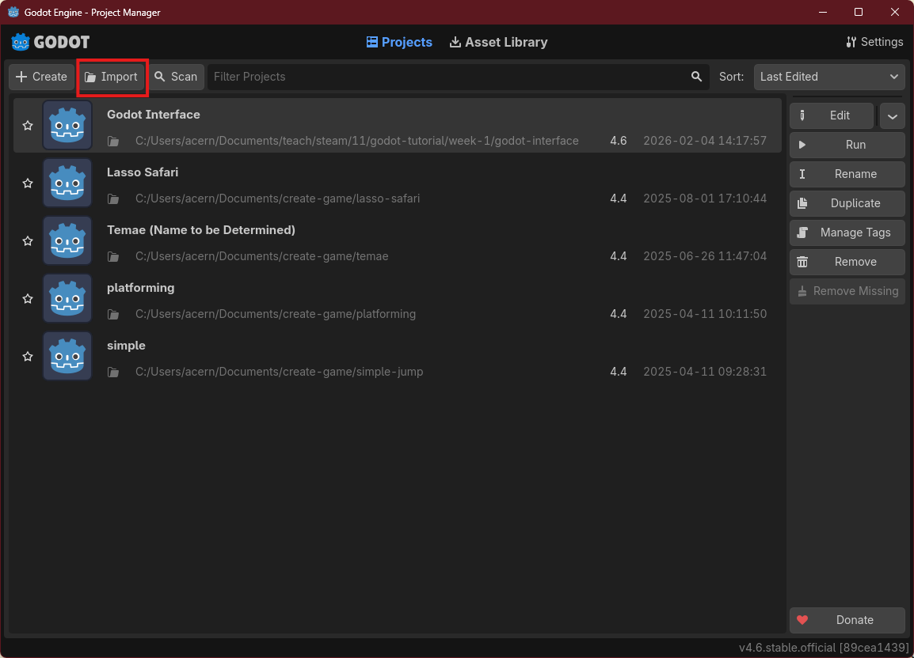
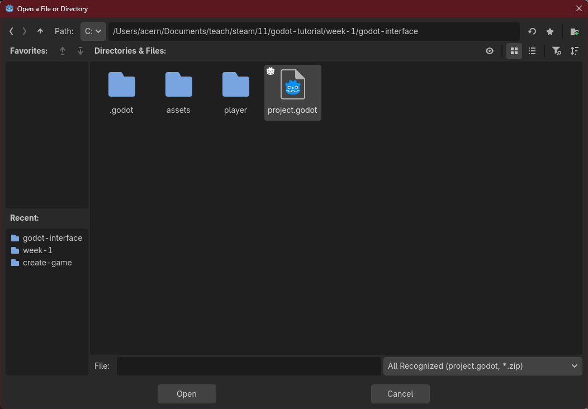

# Familiarizing with Godot's Interface

## Preparation

There are several steps you need to take before using this tutorial.

1. Fork the tutorials repository to your personal github account.
   Make sure your forked repository visibility is set to public so
   that the teacher can check your progress. If you forget how to,
   you can recheck last assigment on forking a repository here:
   https://github.com/Edusteam-Kharisma-Bangsa/11-oxford-git-tutorial
  
> [!NOTE]  
> If you use IpadOS/iOS you need to first install [iSH](https://ish.app).  
> If you use android you need to install [termux](https://play.google.com/store/apps/details?id=com.termux).
> Then you need to install git, with the following command
> (type it to the terminal, by first opening iSH/termux):
> ```
> apk install git
> ```

2. Clone the repository to your device. For this one you need to be
   familiar with the terminal.
   1. First open the terminal
   2. Then type the following command to the terminal
      ```
      git clone <the repository url>
      ```
3. Import the game project under the following directory to Godot:
    1. click on the import button
       
    2. Find the cloned repository, then go to the `week-1` > `godot-interface` folder and click `project.godot` files.
        

## Godot Editor Interface

The Godot Editor interface consists of several panels explained as follows:

1. **FileSystem**: A tab for organizing and structuring files and assets within the open project.
1. **Viewport**: A window that displays the scene in the game, code editor, or Asset Library, according to what is selected in **Workspaces**.
2. **Workspaces**: A panel for switching what is displayed in the Viewport. There are four types:
   - **2D**: Displays the scene in a two-dimensional view.
   - **3D**: Displays the scene in a three-dimensional view.
   - **Script**: Displays the code editor and debugger.
   - **AssetLib**: Displays a library of addons, scripts, and free assets.

3. **Playtest Buttons**: A panel for running the project or scene.
5. **Scene**: A tab that displays the hierarchy of objects in the active scene.
6. **Import**: A window for setting import options for the selected asset file.
7. **Inspector**: Displays specific details of the selected object in the scene. It generally includes a **Transform** component that manages the position, rotation, and scale of the selected object. Specific settings are also available depending on the type of selected object.
8. **Node Tab**: Consists of two parts: **Signals** and **Groups**. **Signals** contain a list of events according to the type of selected object. **Groups** are used to group selected objects into certain categories for easier searching or organizing multiple similar objects.
9. **Output**: Displays the console log from the Godot Engine.
10. **Debugger**: Contains several tools for debugging when encountering issues during development. The available tools are:
    - **Debugger**: Displays the runtime processes.
    - **Error**: Shows errors that occur while running the game.
    - **Profiler**: Displays profiles of each function call that occurs in the game.
    - **Monitor**: Displays performance parameters from the game, such as FPS (frames per second), physics collisions, etc.
    - **Video Mem**: Displays memory usage of the running game.
    - **Misc**: Shows other debug options.
11. **Audio**: A tab that assists with audio settings in the game.
12. **Animation**: A window for creating and managing timing and keyframes of the used animations.

To speed up some operations in the Godot Editor, there are several shortcut keys you can use, such as:

- **F1**: Switch viewport to 2D mode.
- **F2**: Switch viewport to 3D mode.
- **F3**: Switch viewport to script editor.
- **Shift + F1**: Open documentation search view.
- **Q**: Switch manipulation mode to Select.
- **W**: Switch manipulation mode to Move.
- **E**: Switch manipulation mode to Rotate.
- **S**: Switch manipulation mode to Scale.
- **R**: Switch manipulation mode to Ruler.

Other shortcut keys can be viewed in the menu **Editor > Editor Settings > Shortcuts**.

Next, you will get acquainted with the concepts of **Node** and **Scene**, which are fundamental components in games created using Godot.

## Node and Scene

Every object/entity in Godot is represented in a hierarchical structure known as **tree**. In Godot, a game object is represented as a **node**. You can think of a
node as a collection of data and behaviour that represents a single functionality/responsibility, e.g. [`Sprite2D`](https://docs.godotengine.org/en/stable/classes/class_sprite2d.html)
is a node that responsible in drawing a picture of the object, [`PhysicsBody2D`](https://docs.godotengine.org/en/stable/classes/class_physicsbody2d.html)
is a node that responsible handling the physics of the object like collision, etc.


A node in Godot have the following property:
1. It has a name
2. It has properties/data that can be modified
3. It can be extended to add more properties/data or behaviors
4. It can be attached to other node as a child

A hierarchy of node can be saved as a **scene**. You can think of a scene as a collection of nodes that represents a bigger object, like a player, enemies, levels, or entities.
A scene is saved on the filesystem and later can be dynamically loaded into the game (instantiated).
A scene also can be put as child of other scene. If the scene is modified, the modification will be reflected to every instance of that scene.

## Practice: Inspecting a Node

1. **FileSystem Panel**: Displays the collection of files in the project. Currently, there are three scene files ending with `.tscn` and a folder containing image files in PNG format. It is important to remember that all assets in a Godot game must be placed in the game project folder.

2. **Scene Panel**: Displays the hierarchy of nodes in the currently opened scene. The `Game` scene has a root node named `Game`, which contains Four child nodes: `Background`, `Platform`, `Player`, and `Boundary`. Additionally, `Boundary` has two child nodes.

> [!NOTE]
> You can find out the type of a node by hovering the mouse pointer over the node name. A popup will appear showing the type of node under the pointer.

3. **Inspector Panel**: Displays the attributes (properties) of the currently selected node from the Viewport or Scene panel. In the image above, the Inspector panel shows the attributes of the `Game` node. If you click the arrow in the top right, it will show the **Signal** tab.

4. **Viewport**: Shows a visualization of the opened scene. Currently, there is a faint box with a blue outline representing the game view area when the game is eventually run. The area within the blue-outlined box in the Viewport will be visualized on the PC screen when the game starts.

> [!NOTE]
> You can also see a sort of ruler at the outer edge of the Viewport. This ruler provides information about the coordinate positions within the scene. One more thing to note is that the point (0, 0) in the system that displays images on computers typically starts from the top-left corner of the plane, unlike what you may have learned in basic math, which starts from the bottom-left corner.

5. **Playtest Buttons**: Includes buttons to run the game loop for the currently opened project or scene. If you press the **Play** button (shortcut: **F5**), a popup will appear if there is no Main Scene set. Please follow the instructions to set the Main Scene as the Main Scene for this game project. If you want to run the opened scene regardless of whether it is a Main Scene or not, you can use the **Play Scene** button (shortcut: **F6**).
