# Scripting Our Game and Bringing Object to Life

In this tutorial we will learn how to write code in GDScript, Godot Engine's main scripting language,
and how to incorporate it to our game to move objects in our game. At the end of this tutorial, you
will learn how to write a GDScript to implement a simple 2D platformer mechanics.

## Introduction
### Is Scripting an Instrument?

Scripting Language is a programming language that can be run without needing to be compiled. Famous
example of scripting language are Javascript and Python.

Remember when you write a code for an ESP32 in arduino studio? You might remember that before
the code is uploaded to an ESP32 it goes through a compilation stage. For GDScript case, you don't
need to compile the code first. When you run a scene, Godot will directly read the code and run
the code based on what was written in the script.

## GDScript Example

Here's an overview of GDScript:

```gdscript
# Everything after "#" is a comment.
# A file is a class!

# (optional) icon to show in the editor dialogs:
@icon("res://path/to/optional/icon.svg")

# (optional) class definition:
class_name MyClass

# Inheritance:
extends BaseClass


# Member variables.
var a = 5
var s = "Hello"
var arr = [1, 2, 3]
var dict = {"key": "value", 2: 3}
var other_dict = {key = "value", other_key = 2}
var typed_var: int
var inferred_type := "String"

# Constants.
const ANSWER = 42
const THE_NAME = "Charly"

# Enums.
enum {UNIT_NEUTRAL, UNIT_ENEMY, UNIT_ALLY}
enum Named {THING_1, THING_2, ANOTHER_THING = -1}

# Built-in vector types.
var v2 = Vector2(1, 2)
var v3 = Vector3(1, 2, 3)


# Function, with a default value for the last parameter.
func some_function(param1, param2, param3 = 123):
	const local_const = 5

	if param1 < local_const:
		print(param1)
	elif param2 > 5:
		print(param2)
	else:
		print("Fail!")

	for i in range(20):
		print(i)

	while param2 != 0:
		param2 -= 1

	match param3:
		3:
			print("param3 is 3!")
		_:
			print("param3 is not 3!")

	var local_var = param1 + 3
	return local_var


# Functions override functions with the same name on the base/super class.
# If you still want to call them, use "super":
func something(p1, p2):
	super(p1, p2)


# It's also possible to call another function in the super class:
func other_something(p1, p2):
	super.something(p1, p2)


# Inner class
class Something:
	var a = 10


# Constructor
func _init():
	print("Constructed!")
	var lv = Something.new()
	print(lv.a)   
```

> [!NOTE]
> you can read the whole documentation here: https://docs.godotengine.org/en/stable/tutorials/scripting/gdscript/gdscript_basics.html

## Basic 2D Plane Movement

We will need a `CharacterBody2D` object to move left and right and to jump. This tutorial
will demonstrate the following:

 - Creating a `CharacterBody2D` object with a Collision2D and Sprite
 - Write a Script and attach that script to an object
 - Implement a simple Physics

### setting things up

Open this Godot Project in this toturial in the Godot Editor. Next on the FileSystem panel, open
the `game.tscn` file by double clicking the file. There will be a platform and a slime. We will
place an object that we can control there.

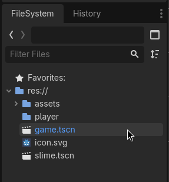

Create a new scene and a `CharacterBody2D` as the root node. Change the name of the node to `Player`.
Add a `Sprite` node and `CollisionShape2D` node as a child node by clicking on the plus icon on the
scene tab.


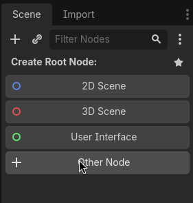
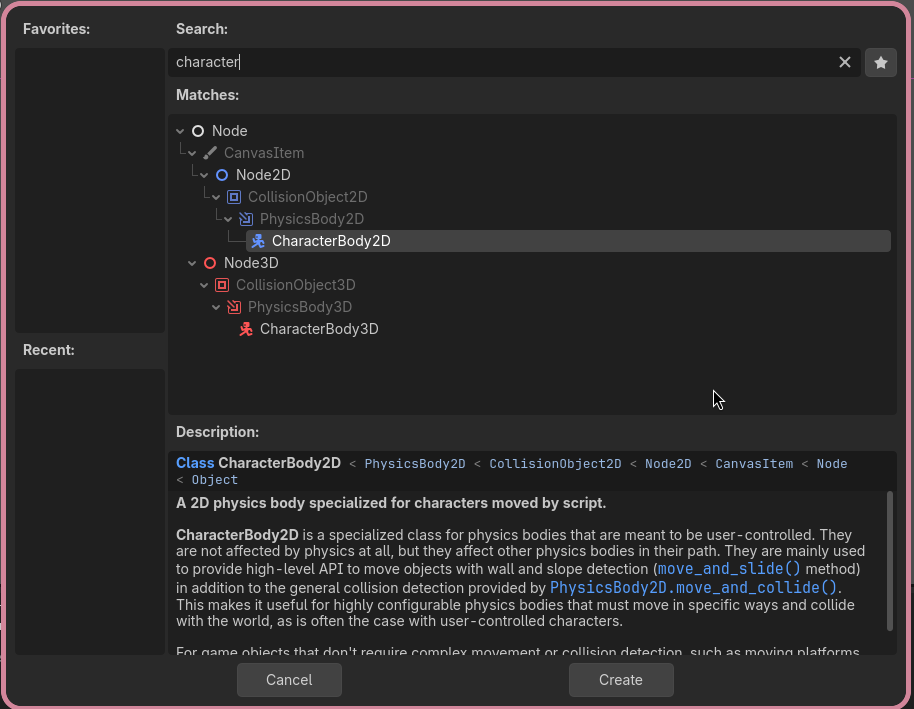
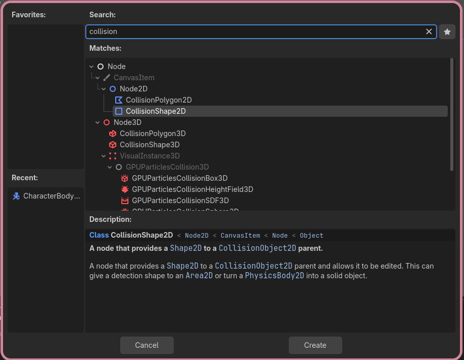
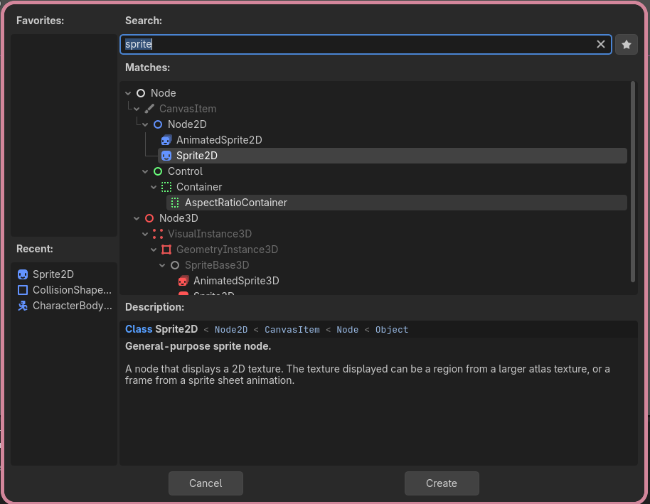
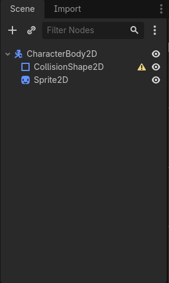

Click on the `CollisionShape2D` node and look on the Inspector panel. Add a shape to the node by
picking new `CapsuleShape2D`.


Click on the `Sprite2D` node and look on the Inspector panel. On the texture menu, click on the `load`
and open the `assets` folder, pick one of the picture available on the folder.


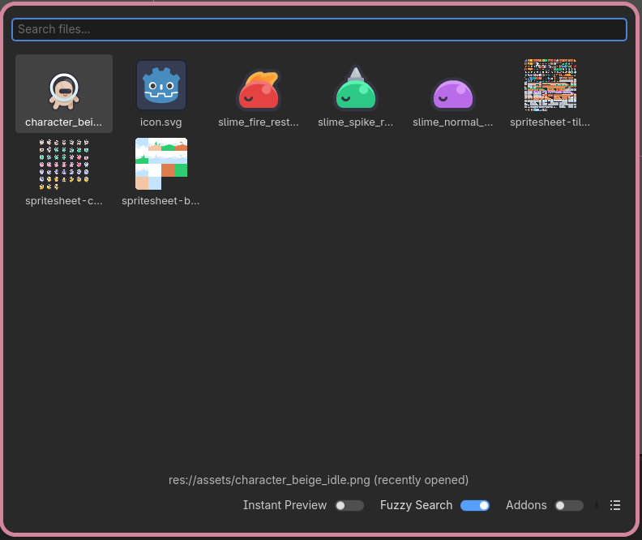

Save the scene. This object will be our scripting target.

> [!NOTE]
> You are free to choose the node's name, scene's name, and sprite. You are allowed to use your own assets.

### Making a Script

On the scene panel, right click on the `Player` node. Pick `Attach Script` on the menu. A menu will pop
up then click on create.

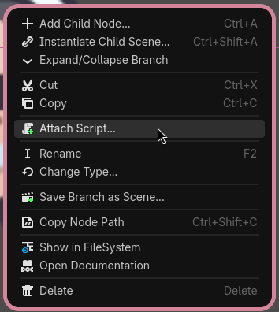
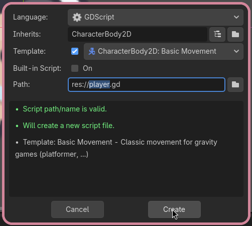

Script will automatically opened on the Godot Editor. Godot 4.6 will provide a template according to
the node's type. In the case of `CharacterBody2D` it will looks like the following.

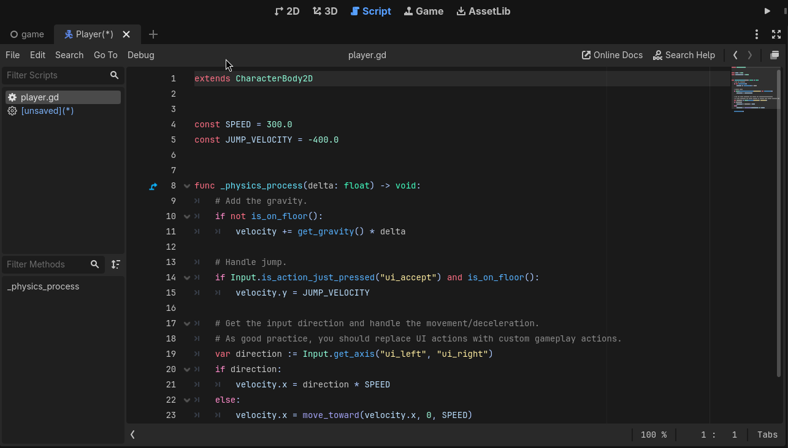

Let's break down the code.

The first line of the code will be the following
```gdscript
extends CharacterBody2D
```

This line tell Godot that this script **extends** the `CharacterBody2D` class. **Extends** mean
this piece of code use some of the code already written on for the `CharacterBody2D`. If you hover
on the text, Godot will show a quick documentation about the class as a menu.

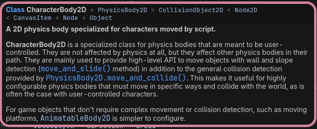

```gdscript
const SPEED = 300.0
const JUMP_VELOCITY = -400.0
```
This is used to defined a constant. Remember what a constant is? It's a value that will never change
when the code run. In GDScript, you can define a constant by using `const` keyword then followed by
an _identifier_ (alphanumeric characters) an equal sign then the value. Right now there's two constant
`SPEED` and `JUMP_VELOCITY`. 

> [!NOTE]
> Constant usually written in all `UPPER_CASE` and underscrores (`_`) so everyone can easily tell
> that this is a constant.

```gdscript
func _physics_process(delta: float) -> void:
	# Add the gravity.
	if not is_on_floor():
		velocity += get_gravity() * delta

	# Handle jump.
	if Input.is_action_just_pressed("ui_accept") and is_on_floor():
		velocity.y = JUMP_VELOCITY

	# Get the input direction and handle the movement/deceleration.
	# As good practice, you should replace UI actions with custom gameplay actions.
	var direction := Input.get_axis("ui_left", "ui_right")
	if direction:
		velocity.x = direction * SPEED
	else:
		velocity.x = move_toward(velocity.x, 0, SPEED)

	move_and_slide()
```

This is a function definition named `_physics_process`. In GDScript to define a function you
start with a `func` keyword followed by an identifier. In GDScript there are several function
that have a special meaning. The more common one are `_ready`, `_process`, and `_physics_process`.

If you remember in arduino, there are function called `loop` and `init`. You can think of `_ready`
as the `init` in GDScript, here you define the initialization step. `_process` and `_physics_process`
is the `loop` function in GDScript. Both function will be called every time all the `_process` and
`_physics_process` function have been called.

The difference between `_process` and `_physics_process`
is that `_process` will be recalled only after Godot have drawn the scene onto the screen, while
`_physics_process` run on a different thread, wo it doesn't need to wait for the scene to be drawn.

```gdscript
	# Add the gravity.
	if not is_on_floor():
		velocity += get_gravity() * delta
```
These lines of code tell Godot to first check if the node is on the floor by calling the `is_on_floor` function.
`is_on_floor` function is already define for the `CharacterBody2D` so our `Player` node can directly
call it. If the `Player` is not on the floor the velocity will be affected by the gravity.

```gdscript
	# Handle jump.
	if Input.is_action_just_pressed("ui_accept") and is_on_floor():
		velocity.y = JUMP_VELOCITY
```
These lines of code check if the `"ui_accept"` input is have just pressed and check if the `Player`
is on floor. If true, the `y` component of `velocity` is set to the `JUMP_VELOCITY` to simulate the
`Player` jumping.

`Input` is a special _class_ that always exist (this concept is known as singleton).
`Input` provides several function related to reading input, here `is_action_just_presses` function
is used to check if a class of input called `ui_accept` have been just pressed recently.

```gdscript
	# Get the input direction and handle the movement/deceleration.
	# As good practice, you should replace UI actions with custom gameplay actions.
	var direction := Input.get_axis("ui_left", "ui_right")
	if direction:
		velocity.x = direction * SPEED
	else:
		velocity.x = move_toward(velocity.x, 0, SPEED)
```
These lines of code tell Godot to check if `"ui_left"` and `"ui_right"` input is being pressed and
here `"ui_left"` is given as the negative value and `"ui_right"` is given as the positive value.
`Input` will aggregate both of the value depending if any of the input group is being pressed.
By default the left and right arrow is part of the `"ui_left"` and `"ui_right"` input group.
If any of the key is being pressed the value of direction will be assigned non-zero value, and
then checked by in the `if` condition.

> [!NOTE]
> Non-zero value is considered as `true` in godot.
